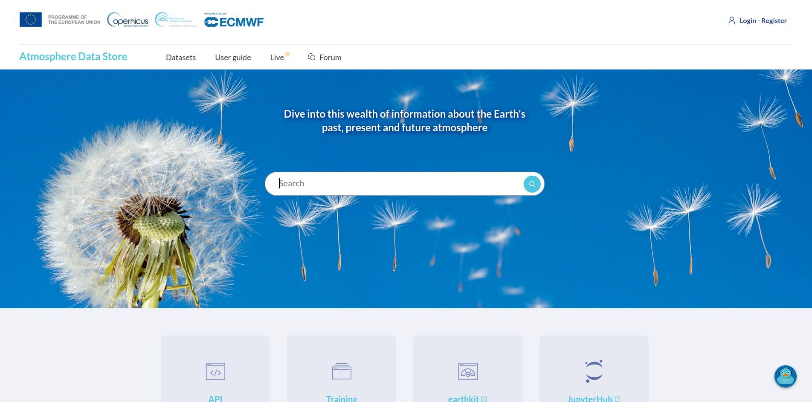
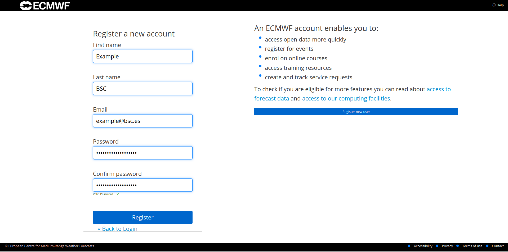
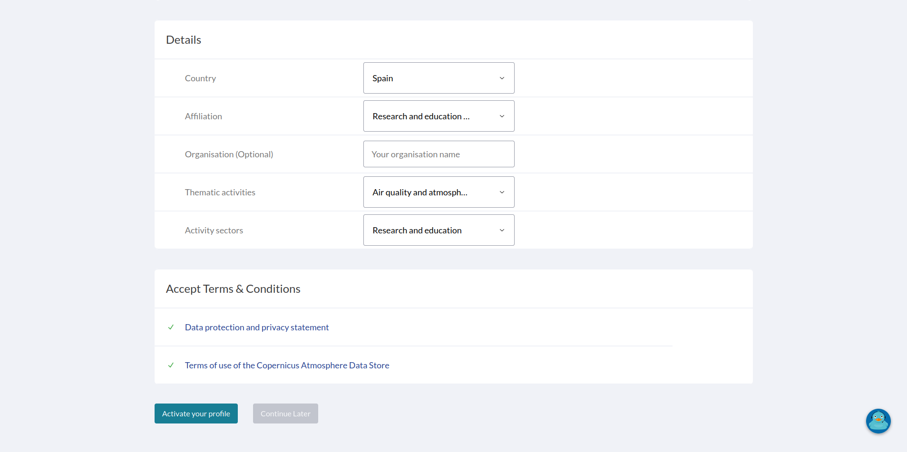
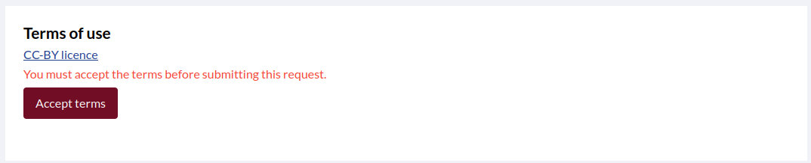
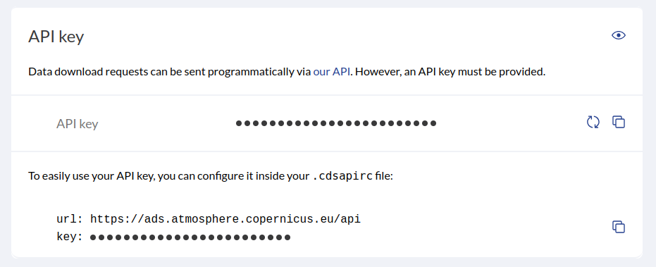

# Account setup

## 1. Create an ECMWF Account

> If you already have an ECMWF account, you can skip this subsection and go to [Prepare the Configuration File](#3-prepare-the-configuration-file).  

Go to the [Atmosphere Data Store page](https://ads.atmosphere.copernicus.eu/) and click **Login / Register** at the top right corner.



Then, click **Register new user** and create a new account.  



Check your confirmation email, accept the **Terms and Conditions**, and fill in the required information to activate your account.  



## 2. Accept Dataset Terms

Navigate to the download page of the dataset you want to download. For example [this](https://ads.atmosphere.copernicus.eu/datasets/cams-europe-air-quality-forecasts?tab=download) one.

> You only need to do this once to any dataset, it will apply to all datasets.

Scroll down to **Terms of Use** and accept the **CC-BY license**.  



## 3. Prepare the Configuration File
Before downloading, prepare your configuration file.  It’s recommended to first read **[How to Enable Atmosphere Data Store Download](#how-to-enable-ads-download)**.  

or 

You can use any of the preconfigured sections in `configurations/cams_dl.conf`. For example:

```bash
./bin/providentia --config=cams_dl.conf --section=cams_analysis_ensemble-regional --dl
```

## 4. API Configuration

> If you had the `~/.cdsapirc` already configured on your computer, you can skip this section.

Once you run the command, the following message will appear:

_"'.cdsapirc' file not found. Creating it at /home/example/.cdsapirc. Do you agree? ([y]/n)"_

Answer `y` to the prompt.

Next, you will be asked for your personal access token:

_"Enter your personal access token, which you can find at [https://ads.atmosphere.copernicus.eu/profile](https://ads.atmosphere.copernicus.eu/profile) after login:"_

Go to the link specified in the prompt, scroll down to **API Key**, and copy it.



Paste your API key on the prompt. Providentia will automatically create the `~/.cdsapirc` file.

> If the API key is incorrect, Providentia will remove the file. You can then run Providentia again and enter the correct API key.

**Congratulations! You are now ready to start downloading CAMS data from the Atmosphere Data Store using Providentia.**