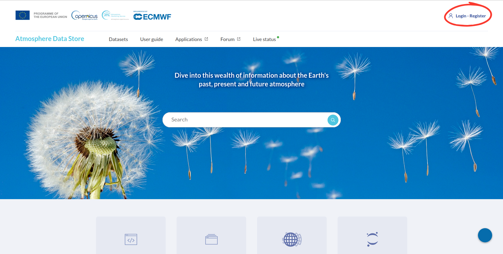
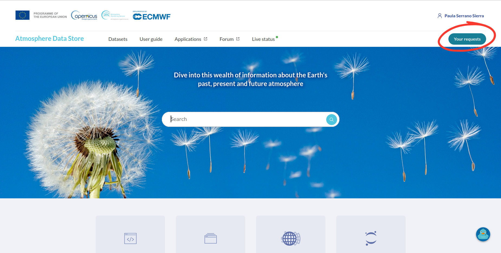
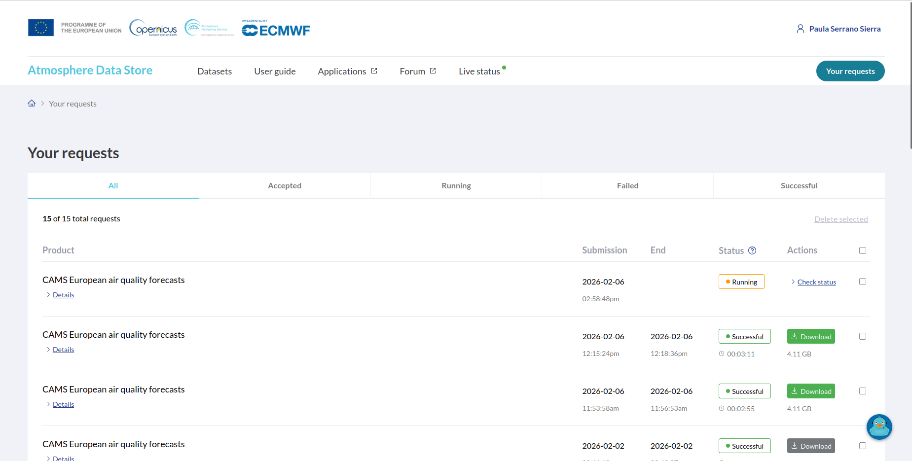
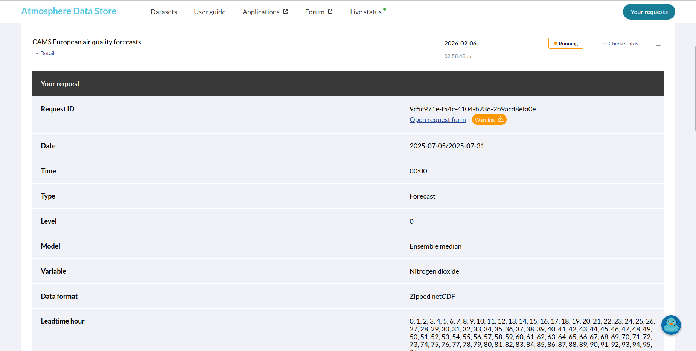

# Check CAMS Download Status

To check the status of a CAMS data download, you need to access the Copernicus Atmosphere Data Store (ADS) website.

## 1. Access the ADS Website

Go to the following URL:

[https://ads.atmosphere.copernicus.eu/](https://ads.atmosphere.copernicus.eu/)

## 2. Log In

Log in using the account you previously created  (see: [Account setup in Atmosphere Data Store](#ADS)).

## 3. Open Your Requests

Once logged in, click on **Your Requests** in the top menu.

## 4. Check Request Status

In the **Your Requests** page, you will see a list of your recent data requests.

- If the request is still being processed, its status will appear as **Running**.
- Completed requests will show a **Successful** status.

## 5. View Request Details

Click on **Details** for a specific request to see additional information, such as:

- Request ID  
- Date
- Time
- Type 
- Level
- Model
- Variable
- Data format  
- Leadtime hour

