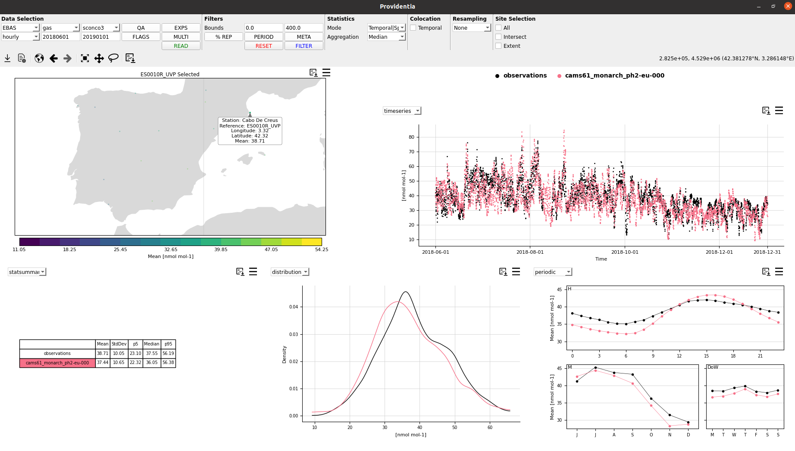
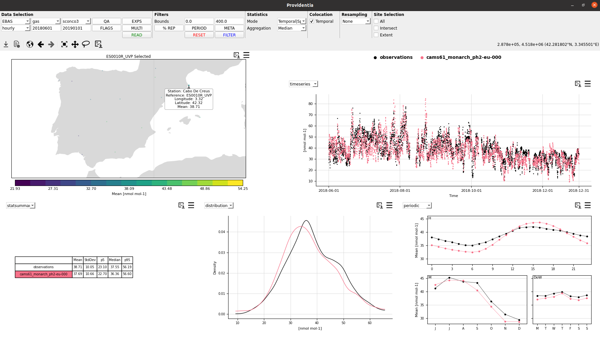
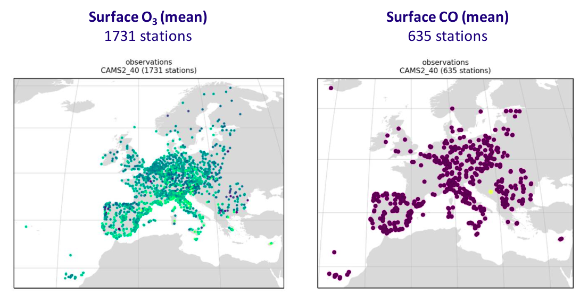
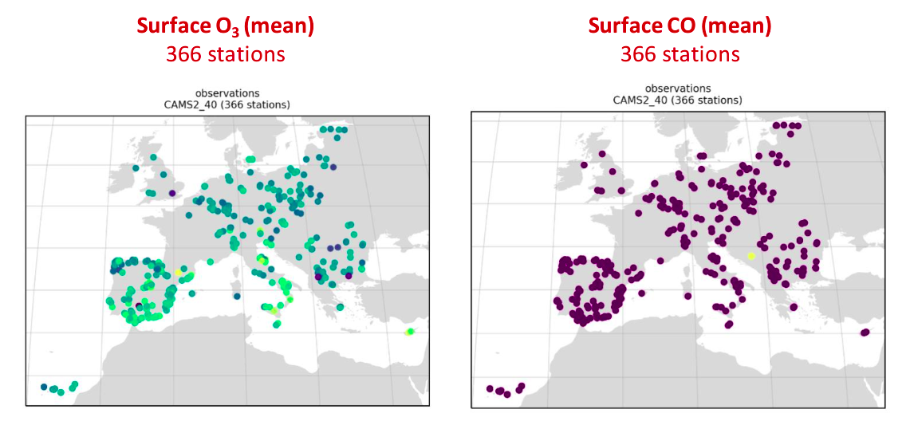

# Colocation

When performing evaluations of model data with observations, it is of high importance to ensure you are comparing apples with apples, rather than apples with oranges.

One way that evaluations can often be biased is due to gapped observations being compared with non-gapped model data. This can be resolved by ensuring both observational and model data is equally temporally gapped, called **temporal colocation**.

When loading multiple species, the number of available stations per species will most likely be different, therefore unless this is controlled for, this will lead to biases when comparing statistics across species. This can be resolved by ensuring only stations which are available for all species are retained, called **spatial colocation**.

The following sections explain how both these colcoation types can be applied in Providentia.

## Temporal colocation

Temporal colocation is used to temporally pair observations and model data, with any missing measurements in either the observational or model array, imposing missing measurements on the respective other. 

When temporal colocation is active, you will have access to more plot types (scatter, taylor, fairmode-target, and fairmode-statsummary), and model bias statistics can also be used (e.g. r), see [here](Statistics.md#available-statistical-metrics) for more information about available statistics.

Temporal colocation can be set in the configuration file by setting a boolean as follows, be default it is **True**:

```
temporal_colocation = False
```

On the dashboard it can be toggled by using the temporal coloction checkbox on the top menu bar.  

**Without temporal colocation:**



**With temporal colocation:**



## Spatial colocation

When loading more than one species we may want to ensure that the stations  measure all the species that we have selected. To do this, we need to activate spatial colocation.

After activating spatial colocation, any stations that do not contain 

Spatial colocation can be set in the configuration file by setting a boolean as follows, be default it is **True**:

```
spatial_colocation = False
```

On the dashboard, only 1 species is allowed to be loaded at once, so in theory it should not be possible to use. However there is a workaround using **filter_species**. If we filter the current loaded species with one or multiple filter species. This trick can be used by loading a configuration file with filter_species** 


**Without spatial colocation:**



**With spatial colocation:**



