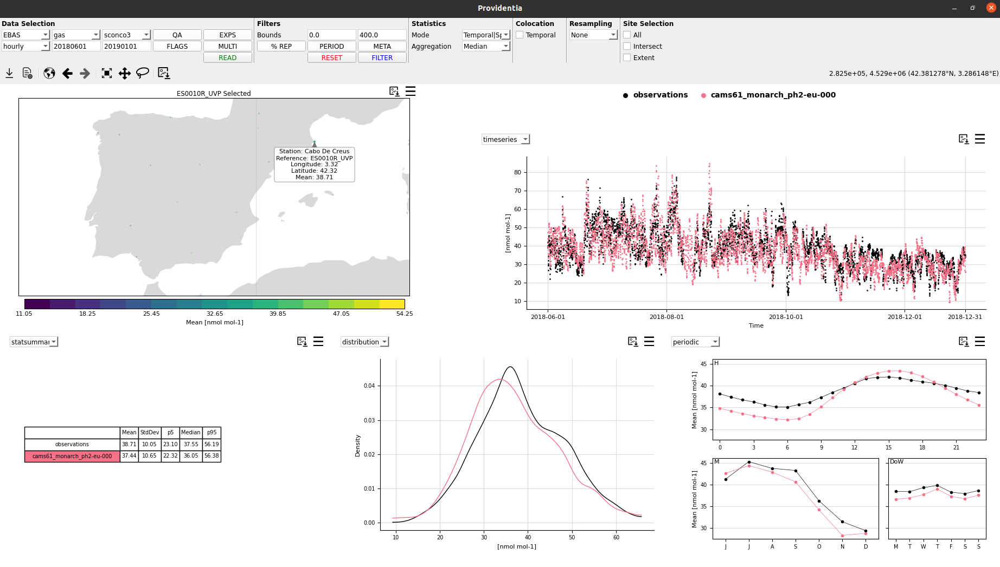
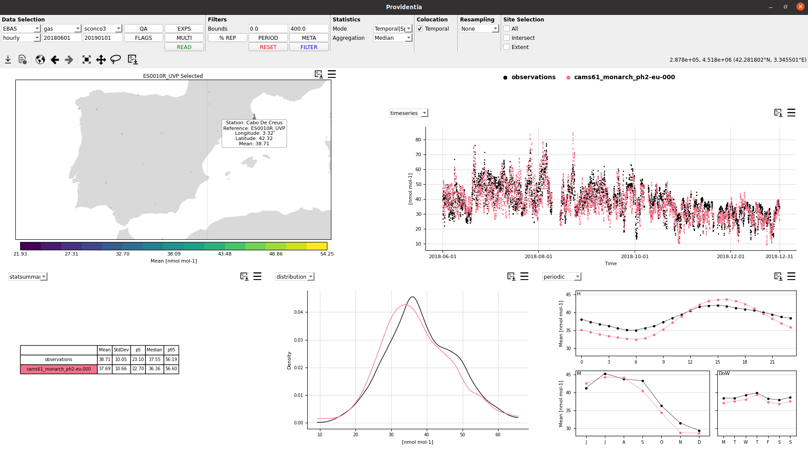
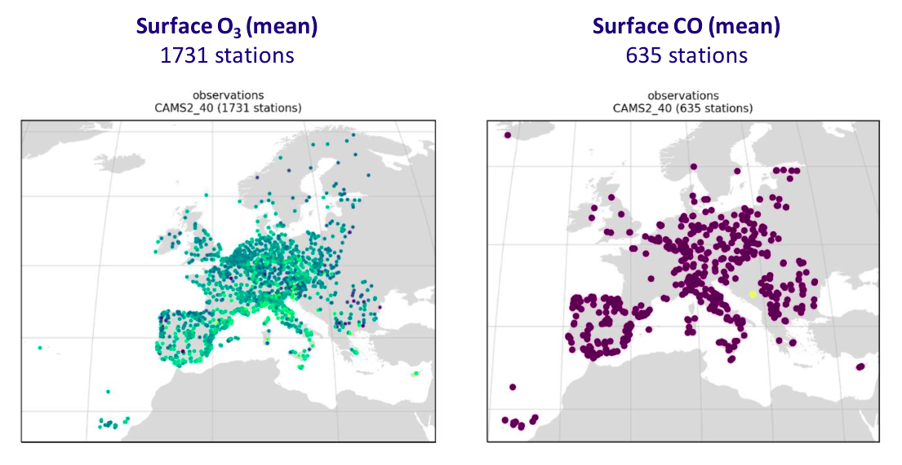
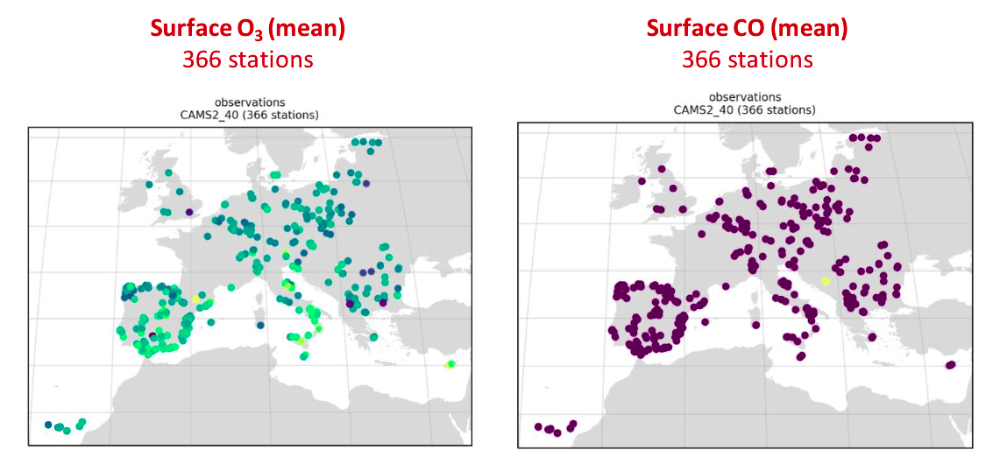

# Colocation

There are two types of colocations that can be used in Providentia:

- Temporal colocation
- Spatial colocations

## Temporal colocation

The temporal colocation can be used to remove the gaps where the data of the observations or experiments are missing. Once the colocation is turned on, the user has access to more plot types (i.e. scatter plot and Taylor diagram).

**Without temporal colocation:**

**With temporal colocation:**

## Spatial colocation

When loading more than one species we may want to ensure that the stations that we have in our network/s measure all the species that we have selected. To do this, we need to activate the spatial colocation.

**Without spatial colocation:**

**With spatial colocation:**

If you see that the number of stations is not equal, but has been reduced, it might be that the missing stations have NaN values for the current period.

In the dashboard, the spatial colocation is always on by default since we do not load multiple species at the same time, except when we use the multispecies filtering.