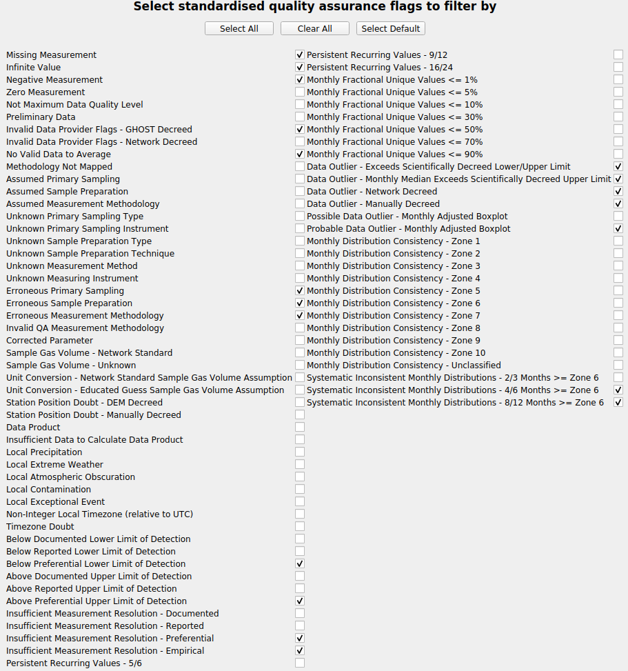
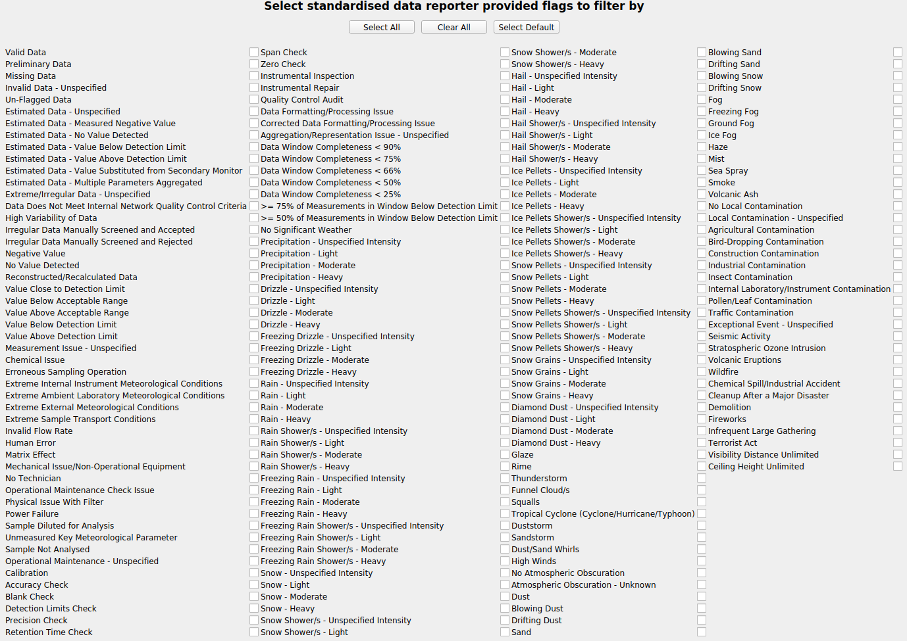
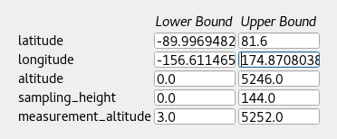
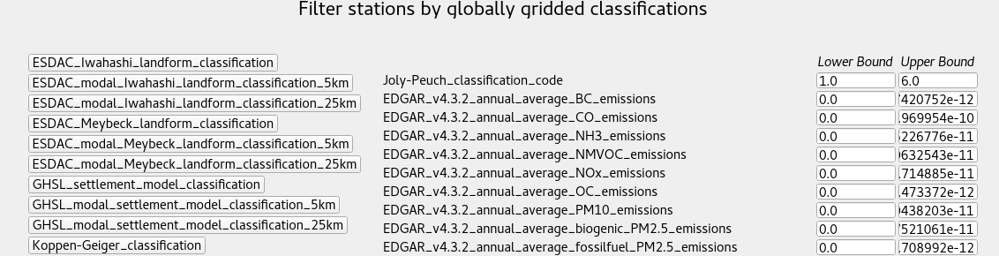

# Configuration files

Configuration files are needed to get reports and useful to launch the dashboard since that way you can have all your preferred options in one file and load them.

## Overview

A basic configuration file looks like the following:

```
[PRV_sconco3_a365]
network = EBAS
species = sconco3
resolution = hourly
start_date = 20180101
end_date = 20180601
experiments = cams61_chimere_ph2-eu-000, cams61_monarch_ph2-eu-000
temporal_colocation = True
spatial_colocation = True
report_type = standard
report_summary = True
report_stations = False
report_title = Report
report_filename = PROVIDENTIA_Report
```

This configuration can also have subsections, as in:

```
[PRV_sconco3_a365]
network = EBAS
species = sconco3
resolution = hourly
start_date = 20180101
end_date = 20180601
experiments = cams61_chimere_ph2-eu-000, cams61_monarch_ph2-eu-000
temporal_colocation = True
spatial_colocation = True
report_type = standard
report_summary = True
report_stations = False
report_filename = PROVIDENTIA_Report
report_title = Report

    [[Barcelona]]
    latitude = 39.8, 41.8
    longitude = 1.5, 2.5
    period = keep: Spring, Daytime

    [[Madrid]]
    latitude = 39.57, 42.2
    longitude = -4.57, -2.42
    standardised_network_provided_area_classification = keep: rural || remove: urban-suburban
```
### Sections

It is **mandatory** to define sections to launch Providentia. Their names must be wrapped in brackets (`[ ]`) and cannot include interpuncts (`·`). Sections should contain the following fields:

| Parameter | Mandatory | Description |
| ------ | ------ | ------ |
| network | ✓ | Network you want to load observations from. Can be multiple (e.g. `CAPMoN, EBAS`). Adding a wild card (\*) is going to expand to certain variables (vconc* → vconc1, vconc2, etc.). |
| species | ✓ | Species to load. Can be multiple (e.g. `sconco3, sconcno2`). |
| resolution | ✓ | Temporal resolution of the observations you want to load (e.g. `3hourly`). |
| start_date | ✓ | Comparison start date in YYYYMMDD format (e.g. `20170101`). |
| end_date | ✓ | Comparison end date in YYYYMMDD format (e.g. `20180601`). |
| experiments | ✗ | ID of interpolated experiment using providentia-interpolation. The experiment IDs can be mapped to different names by adding a list of alternative names after the experiment IDs (e.g. `exp1, exp2 (altexp1, altexp2)`). |
| temporal_colocation | ✗ | Boolean variable to set if you want to temporally colocate the observation and experiment data. |
| spatial_colocation | ✗ | Boolean variable to set if you want to spatially colocate the observation and experiment data across multiple species. |
| statistic_mode | ✗ | Statistic mode: Temporal&#124;Spatial (default), Spatial&#124;Temporal or Flattened. |
| statistic_aggregation | ✗ | Aggregation statistic, e.g. Median. |
| timeseries_statistic_aggregation | ✗ | Timeseries aggregation statistic, e.g. Median. |
| periodic_statistic_mode | ✗ | Periodic statistic mode: Independent (default), Cycle. |
| periodic_statistic_aggregation | ✗ | Periodic aggregation statistic, e.g. Mean (default). |
| filter_species | ✗ | Filter read species by other species data within a data range (can be multiple) (e.g. `network1:species1 (lowerlim, upperlim), network2:species2 (lowerlim, upperlim)`). |
| lower_bound | ✗ | Filter out data lower than this set limit. If multiple species are being read then this can either be one value, setting the same limit across species, or multiple values per species (e.g. `3, 4, 5`). |
| upper_bound | ✗ | Filter out data above this set limit. If multiple species are being read then this can either be one value, setting the same limit across species, or multiple values per species (e.g. `3, 4, 5`). |
| report_type | ✗ | Type of report to generate that defines which plots the report will contain, from the options given in `report_plots.json`. |
| report_summary | ✗ | Boolean variable to set if you wish to make specific plots for each station in subsection. |
| report_stations | ✗ | Boolean variable to set if you wish to make summary plots across station subsection. |
| report_title | ✗ | The header in the first page of the report (as in the PDF). |
| report_filename | ✗ | The filename of the report or the path to create the report (as in the PDF). |
| map_extent | ✗ | Set the map plot extents with the syntax: minimum longitude, maximum longitude, minimum latitude, maximum latitude. |
| plot_characteristics_filename | ✗ | The path to the file containing the plot characteristics. |
| active_dashboard_plots | ✗ | Plots that will be active in the dashboard once it is launched (e.g. `timeseries, periodic-violin, scatter, distribution`). |
| harmonise_stations | ✗ | Boolean variable to set if you wish to harmonise axes limits across stations for stations report. |
| harmonise_summary | ✗ | Boolean variable to set if you wish to harmonise axes limits across subsections for summary report. |
| observations_data_label | ✗ | Alternative name for observations. |
| remove_extreme_stations | ✗ | Type of extreme stations removal, from the options given in `remove_extreme_stations.json`. |
| resampling_resolution | ✗ | Resolution you want to resample your data to. Options: `hourly`, `daily`, `monthly`, `annual`.|
  
Defining a list of experiments is optional since the user might only want to check the observations data.

In the offline version, there will be a report per section. In the dashboard, you will only be able to load one section or subsection at a time.

#### Use of non-GHOST networks

Providentia can be used both with GHOST and non-GHOST netCDF files. Users should add the path to their network in `settings/nonghost_files.json`. In the configuration file, you can refer to non-GHOST files like:

```
network = port_barcelona/port-barcelona
```

### Subsections

After defining the sections, the user can optionally create subsections and set specific information for each one. In order to do this, it is important to wrap the subsection names in double brackets (`[[ ]]`).

These subsections must be located under the sections, including the details of the data subsections that you want the evaluation to be focused on. Above are included as examples two areas that we want to analyse, Barcelona and Madrid. For these separate sections, it is necessary to define the latitude and longitude which describe the area in order to delimit the analysis to the desired area. In the example, we used the following parameters for Madrid:
```
[[Madrid]]
latitude = 39.57, 42.2
longitude = -4.57, -2.42
```

We can also get the data for all the stations in a country, in this case Spain, by writing:
```
[[Spain]]
country = keep: Spain
```

Additionally, we can apply metadata filters. In the subsection for Madrid, we constrained the stations according to the `standardised_network_provided_area_classification` criteria:
```
standardised_network_provided_area_classification = keep: rural || remove: urban-suburban
```

If you do not know which names can be used to filter the metadata, you should use the dashboard to select the fields, export the configuration [exporting feature](https://earth.bsc.es/gitlab/ac/Providentia/-/wikis/Dashboard#exporting-data-or-configuration) and copy the fields that you want from there.

`NOTE: The field names in the configuration files are case-insensitive, meaning that if you use capitals or small-cases (providing that the spelling is correct), then the field will be read properly.`

### Advanced options

In the basic overview, we include the minimum necessary fields that every configuration files should have, and how they should be written. Here, we will have a look to the fields that are included under the other options (QA, filters, META, etc.)

All the QA and flags have an associated name and number to them. Their number can be found in the wiki page [Data flags and QA names and codes](Data-flags-and-QA-names-and-codes).

#### QA



The QA window contains contains a menu where you can select the quality assurance flags that you want to filter by. Providentia has a default set of these flags selected according to the species you select to load. However, users can select more filters, remove them all, or define their own. Following we summarize how you can perform these actions using your configuration file.

##### Select a new set of QA flags

The field's name is simply QA. Then, you can assign to that field the new set of flags you want to select. You can define the flags either by their codes:

```
QA = 0,1,2,3
```

or by using their full names:

```
QA = Missing Measurement, Infinite Value, Negative Measurement, Zero Measurement
```

##### Remove them all

If you do not want to apply any QA filter, then you should define the field and leave it empty. Not defining it does not mean that there will be no QA selected. Therefore, if you want zero QA flags, then you should write the field as in the example below:

```
QA = 
```

All the options to set the QA flags can be found in [Data flags and QA names and codes](Data-flags-and-QA-names-and-codes).

#### Flags



Exactly the same principles apply in the case of flags. The only difference is that there is no default set of flags selected. Actually, the default set is empty. For example, for the following flags, if you want to select Preliminary Data.

Then you would have to define in your configuration:

```
flags = Preliminary Data
```
or:

```
flags = 1
```

All the options to set the data flags can be found in [Data flags and QA names and codes](Data-flags-and-QA-names-and-codes).

#### Representativity bounds


For the case of the representativity fields, the way to define them is to write the name of the field in the same way as it appears in Providentia and assign to it the value you want. For example, if you want the hourly native representativity percent to be 20%, then you would define it as in the example below. In the same way you can define all of the filters of the representativity menu.

```
hourly_native_representativity_percent = 20
```

All the fields of representativity, with their default values can be found in [Representativity filters](Representativity-filters).

#### Period


The period filters give the option to Keep (K) or Remove (R) specific observations according to period criteria. 

In the configuration files we define a simple syntax to define the options you want to keep or remove. We explain this syntax with an example. Let's assume that we want to keep observations in Winter, during Daytime, and exclude data from weekends:

```
period = keep: Winter, Daytime || remove: Weekend
```

In detail, the syntax works as following: The fields you want to keep you should write it after "**keep:**", separate the fields you include with a comma. Exactly the same applies for the fields that you want to remove, you just start with "**remove:**". Finally, add a **double pipe "||"** between the keep and remove definitions to distinguish between them.

It is not necessary to have both **keep** and **remove** set. You can define only one of the two:

```
period = keep: Daytime
```

#### Metadata


The metadata filters that we find below the META menu can be classified into two categories:
- Fields that accept a range of values, with a lower bound and an upper bound
- Fields that have a list of options that we can keep or remove

##### Fields with lower/upper bound

The sub-menu of Station Position is a good example of fields that have lower/upper bounds:



For defining a field that accepts a range of value in this format, then you should write the name of the variable and then write the values of lower bound and upper bound separated by a comma: **variable = lower, upper**. In the example below we define the variables latitude and longitude:

```
latitude = 30, 72
longitude = -12, 35
```

The same principle applies for all the fields under the META window that have a lower/upper bound field. For example, under the sub-menu of Globally Gridded Classification there are a number of options that can take a range (screenshot below). If you want to define for example the variable Joly-Peuch_classification_code, then you need to define in the same way as in the example above:

```
Joly-Peuch_classification_code = 1,6
``` 



##### Fields with keep/remove options

For the defining this type of fields, the principle is exactly the same with the one we described in the case of **Period**. In the configuration file, you will need to write the variable name (for example: *period, country, WMO_region, measuring_instrument_name*) and then follow the syntax **keep: x, y || remove: w,z**

Example:

```
period = keep: Daytime
standardised_network_provided_area_classification = keep: rural || remove: urban-suburban
standardised_network_provided_station_classification = keep: background
country = keep: Spain
```

#### Bounds

For setting the values bounds, then you define them as following:

```
lower_bound = 10
upper_bound = 1000
```

Additionally in the case of multiple species, then multiple bounds can be given for the number of species that exist, e.g.:

```
lower_bound = 10, 20, 30
upper_bound = 1000, 2000, 3000
```

#### Calibration factor

The calibration factor can be used to modify the data of your experiments. To use it, users need to set the `calibration_factor` in the configuration file, as in:

- To add:
```
calibration_factor = +10
```
- To subtract:
```
calibration_factor = -10
```
- To multiply:
```
calibration_factor = *10
```
- To divide:
```
calibration_factor = /10
```

The calibration factor could also be defined for diferent experiments in this way:
```
calibration_factor = a54s-regional-000 (*0.62), a4xf-regional-000 (*0.51)
```

Using diferent species, we would need to add the factors to the list of each experiment:
```
network = EEA_AQ_eReporting
species = pm2p5, pm10
calibration_factor = a54s-regional-000 (*0.62, *0.4), a4xf-regional-000 (*0.52, *0.9)
```
Where 0.62 would be applied to pm2p5 and 0.4 to pm10 for a54s-regional-000 data and 0.52 to pm2p5 and 0.9 to pm10 for a4xf-regional-000.