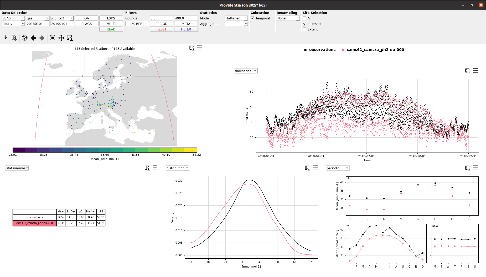
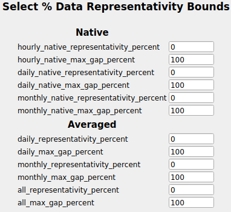
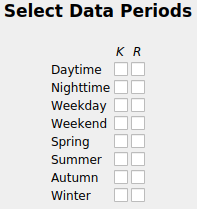
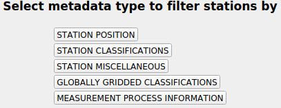
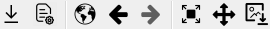
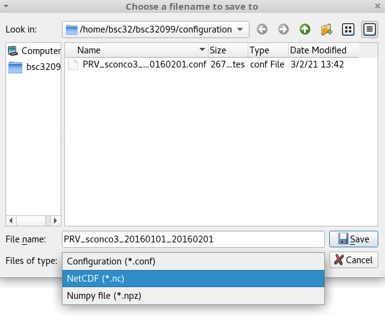

# Dashboard

Providentia's dashboard was designed to allow on-the-fly analysis of BSC experiment output, with respect to GHOST processed observational data.

## Interface

There are several available options to perform the analysis. The header of the window contains the fields that the user can fill, which is separated into 6 sections: 

- Data Selection
- Filters
- Statistics
- Colocaiton
- Resampling
- Site Selection

### Data Selection
Under this section, there are four drop-down menus. The first option that the user should fill is the data provider (e.g., EIONET, EBAS, etc.). Then, the further three menus will show the available options that correspond to the selected provider and refer to specific variables and data frequency (hourly, daily, monthly, etc.).

Next, there are three fields with pop-up menus: **QA, Flags, and Exps**.
* **QA** contains the quality assurance flags to filter by.
* **Flags** contain standardised data reporter provided flags to filter by.
* **Exps** contains a list of experiments that exist and are related to the variable selected.

`NOTE: If under the **QA** menu, the checkboxes ‘*Invalid Data Provider Flags – GHOST Decreed*’ or ‘*Invalid Data Provider Flags – Network Decreed*’ are selected, all checkboxes under the Flags menu should be unticked (the default setting). This is because ticking one of these checkboxes sets a pre-selected subset of Flags checkboxes automatically. For this reason also, only one of these QA checkboxes should be ticked at the same time.`

Additionally, here the user can fill the date range. In the case of there being no available data for the requested dates, there will be no data loaded.

After having filled all the fields that the user is interested in, then the last step is to click **Read**. If the user makes changes to any of the fields, it is needed to click on **Read** again in order to apply the changes.
After reading the data, the map appears showing the available stations that correspond to the data selection. The user can select either one station individually (by clicking on it) or multiple ones by drawing a circle around them.

Finally, the Data Selection section contains the option **Colocate**. When selected this means that all observations and experiment data are forced to temporally intersect, and if not (i.e. there exists observations but no experiment data, or vice versa), then these time periods will be set as NaN. After having loaded the data and selected the desired stations, if the user chooses to colocate, there is no need to **Read** again, the changes apply immediately.

#### Available networks

The drop-down menu of the available networks shows the names of the networks that have available data for the selected date range.

`NOTE: The networks' data that are stored in /esarchive are **not** accessible from MareNostrum4. If you want to use these data, then you should run Providentia from **Nord3**.`

#### Example

In the following image, we can see the output for Providentia where we compare the experiment cams61_camsra_ph2-eu-000 with actual observations for ozone. We load the observations and experiment data over 2018 and we select *Intersect*, so that the stations within the experiment's domain are automatically selected.

In the figure above we see that the data were loaded and plotted. However, there might some data gaps in the observations or in the experiments. This might result in an inaccurate analysis. By selecting **Colocate**, Providentia will apply the temporal intersection of data points that exist in both the network and experiment datasets. The result of the previous example would be:

### Filters

#### Bounds

Any data that is above/below these limits will be set as NaN. These are automatically assigned per variable. However, the user can modify them if needed.

`NOTE: In Data Selection → QA if the user selects the option of *Extreme Data*, then the extremes values will be filtered out either way.`

##### % REP

This option refers to the minimum acceptable percentages of data across the data that is not NaN. All stations which do not meet this minimum requirement will be screened out.

##### PERIOD

The pop-up menu of **Period** allows the user to select data periods by either using the options *keep* (**K**) or *remove* (**R**). If a user wishes, for example, to keep only the data that correspond to Daytime, then he/she can select to keep option under the *K* column, close the window and click **FILTER**. 

##### META

The pop-up menu of **Meta** contains a number of metadata types for the user to filter by. As there are many options, there have been separated into five categories.

Each category provides a plethora of options. The user can filter by latitude, longitude, altitude. Or filter by area classification (rural, urban, etc), land use, emission source, etc. The options are numerous, explore! 

##### RESET

The *RESET* button will set all the fields under the *Filters* section back to their initial values and it will unfilter the loaded data. 

##### FILTER

The *FILTER* button will set all the selected fields under the *Filters* section and the loaded data will be filtered. 

### Statistics

This section provides ways to spatially visualise specific statistical information across all loaded stations. You can read more details about how the statistics are calculated in [Statistics](https://earth.bsc.es/gitlab/ac/Providentia/-/wikis/Statistics).

### Site Selection

Under this section there are three options: 

- **All**: It selects data from all the stations that appear on the map.
- **Intersect**: It selects data from stations that spatially intersect with the experiments grid edges. 
- **Extent**: It select the data on the current map view.

### Toolbox

Under the main option fields, there is a toolbox that gives users several options.

In order from left to right, these are:

- **Export button**: To export the data that users used for their evaluation (observations and experiments) in NetCDF or Numpy files and the corresponding configuration file.
- **Load button**: To load the configuration file from previous evaluation sessions. For instance, those saved using the export button.
- **World button**: To return to the initial state of the map and the plots before applying any option.
- **Backward arrow button**: To move to one state back from the current dashboard state.
- **Forward arrow button**: To move to one state forward from the current dashboard state.
- **Zoom to rectangle button**: To zoom in an area in the map or the plots. Users can also scroll with the mouse wheel to do this progressively in the map.
- **Pan button**: To move around the map and the plots.
- **Figure button**: To save a screenshot of the current map view and plots.

#### Exporting configuration files and data

If you click on the export button, a pop-up window will appear to ask you where you want to store your output. From this window you can select what export format you want to use.
 
- In the case that you want to export data, then you can export them either in a **NetCDF** (.*nc) file format, or as a **Numpy file** (.*npz). For more information around the exported data, go to the wiki page [Saved file formats](Saved-file-formats)
- In the case that you want to export only the configuration, then you need to select **Configuration**.

#### Loading a configuration file

Providentia has the option to load a configuration file that you have either written from scratch, or that you had exported during a past evaluation. 

Loading a configuration file means that the tool will reset the options you have at that moment, and use the configuration with the new variables and filters.

If there is more than one section or subsection, users will be asked to choose which one they want to load.

