# Dashboard

Providentia's dashboard was designed to allow for interactive quick-look visualisations of observations and colocated model output.


## Getting started

To start the dashboard, run the following command in the command line. The configuration file is optional:

```
./bin/providentia --config='/path/to/file/example.conf'
```

The dashboard mode only fetches content from one section of the configuration file.
If more than one section is defined, a pop-up will appear asking you to select the desired section:

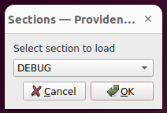

Alternatively, you can specify it directly using the `--section` parameter.

## Menu bar

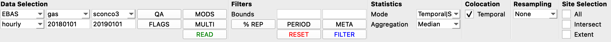

After launching the dashboard you will see at the top of the window a menu bar with multiple drop-down menus and buttons that can be selected.

The main options can de separated into 6 distinct sections: 

- **Data Selection**
- **Filters**
- **Statistics**
- **Colocation**
- **Resampling**
- **Site Selection**

### Data Selection

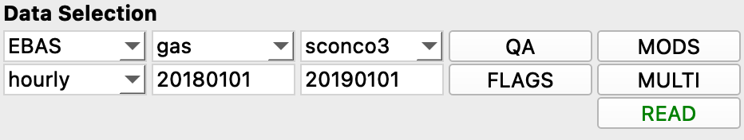

Under this section, to the furthest left there are four drop-down menus and two rangeboxes. The rangeboxes will contain a default start date and end date (in the format YYYYMMDD). Change these if you wish to analyse a different time period. 

Once the time period had been updated the drop-down menus will update to show the available observational data providers (network), temporal resolutions, matrix (type of observations), and species. Select the desired fields from each menu.

Next, there are four pop-up menus:
* **QA** contains the GHOST quality assurance flags to filter observations by, as explained in [QA](QA-filtering.md).
* **FLAGS** contain standardised data reporter provided flags to filter observations by, as explained in [Flags](QA-filtering.md).
* **MODS** contains a list of models that are available to load for the current data selection.
* **MULTI** can be used to filter your current network-species by the values of other network-species, as explained in [Multispecies filtering](Multispecies-filtering).

After having set all the fields that the user wants, then the last step is to click the **READ** button. After reading the data, a map plot appears showing the available stations that correspond to the data selection. 

If the user makes changes to any of the fields in this section, it is needed to reclick on **READ** in order to apply the changes.

### Filters

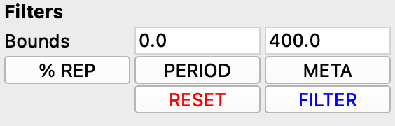

The filters section provides a variety of options to filter data or stations. A detailed review of all the filter options available in Providentia can be found here: [Filtering](Filtering).

After having selected or modified any filters in this section, simply click the **FILTER** button to apply the filters, or the **RESET** button to undo any filters back to the defaults. 

#### Bounds

Often it is desired to remove values which exceed certain extreme bounds, as it is known that data should appear at such extremes. These bounds will be by default set on the dashboard, taken from definitions per species in GHOST. These can be revised up or down as the user sees fit.

##### % REP

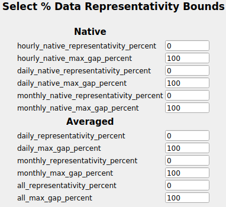

One major limitation often associated with observations is the amount of gaps between measurements. If these observations are directly compared with typically complete model data, this would impose a significant bias upon the comparison. Filtering by representativity filters provides a way to control the temporal robustness of the observations for evaluation. Providentia has multiple such filters available in the pop-up menu opened via the **% REP** button.

See here for more information about representativity filters: [Representativity filtering](representativity)

##### PERIOD

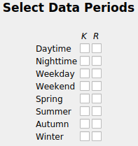

The **PERIOD** button opens a pop-up menu that allows for the selection or removal of specific data periods, for example keep daytime data, or remove summertime data.

See here for more detailed information: [Period filtering](periods)

##### META

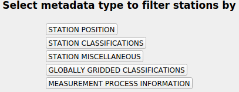

The **META** button opens a pop-up menu allows the user to filter stations on the map by a variety of metadata variables. See here for more detailed information: [Metadata filtering](filtering_metadata)

### Statistics

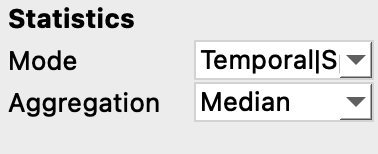

The **Statistics** section allows for control of how statistics are calculated across the dashboard.

The **Mode** drop-down menu allows for the statistical mode to be selected, fundamentally altering the calculation of statistics 

The **Aggregation** drop-down menu controls how data is aggregated across stations when more than one station is selected.

You can read more details about how the statistics are calculated in [Statistics](Statistics).

### Colocation

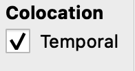

When performing evaluations of model data with observations, it is of high importance to ensure you are comparing apples with apples, rather than apples with oranges.

One way that evaluations can often be biased is due to gapped observations being compared with non-gapped model data. This can be resolved by ensuring both observational and model data is equally temporally gapped, called **temporal colocation**

Temporal colocation is used to temporally pair observations and model data, with any missing measurements in either the observational or model array, imposing missing measurements on the other. 

When temporal colocation is active, you will have access to more plot types (scatter, taylor, fairmode-target, and fairmode-statsummary). See here for more information about [plot types](Plot-types-and-options). Additionally model bias statistics will also be available when temporal colocation is active (e.g. r). See here for more information about [available statistics](available_statistics).

### Resampling

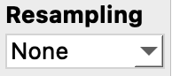

The resampling section allows the plotted data to be resampled to a coarser temporal resolution (by the mean), e.g. hourly to daily, by clicking on a resolution from the drop-down menu. When a resolution is selected, it updates the plots and statistics across the dashboard.

### Site Selection

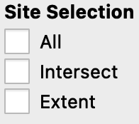

This section gives three options for selecting multiple stations on the map:

- **All**: Selects all the stations that appear on the map.
- **Intersect**: Selects stations that spatially intersect with all model domains that are currently active.
- **Extent**: Selects stations that are within the boundaries of the map currently plotted on screen. 

## Toolbar

Directly under the menu bar, there is a toolbar that gives several useful options: 

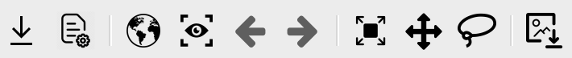

In order from left to right, these are:

- **Export**: Exports the active state of the dashboard. This can be done to save the loaded data (both observations and model data) directly as a NetCDF or Numpy file, or to save the current state as a configuration file. For more information about exported data see [Saved file formats](Saved-file-formats).
- **Load**: This can be used to load a configuration file from a previous evaluation session. For instance, those saved using the export button. If there is more than one section or subsection, users will be asked to choose which one they want to load.
- **World view**: Sets the map to the entire world view.
- **Original state**: Returns all plots to their initial states.
- **Undo**: Undos a plot action, i.e. undos a zoom on a plot
- **Redo**: Redos a plot action, i.e. redos a zoom on a plot
- **Zoom**: To zoom in on area, on any plot. Users can also scroll with the mouse wheel to do this progressively while on the map.
- **Pan**: To pan around on any plot.
- **Lasso**: When this is toggled on, by holding down the left mouse button over the map a lasso will appear allowing multiple stations within a closed lasso to be selected. Remember to un-toggle this to go back to normal station selection.
- **Save**: To save a screenshot of all current plots.

## Plot interactivity

### Selecting stations

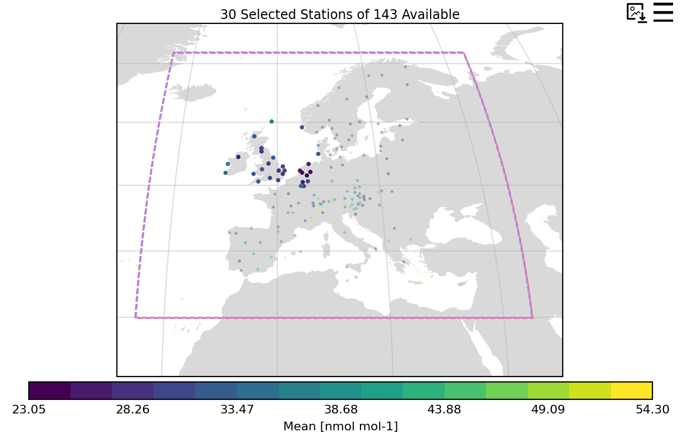

Once data has been loaded on the dashboard, by left clicking on a station the map, multiple plots will appear showing data for that station.

Multiple stations can also be selected at once. This can by doing by using the **site selection** menu options, or by using the toolbar **lasso**, or a third way is to right click on a station while another is selected. By right clicking on an already selected station, it will be unselected.

When multiple stations are selected, data on the plots will reflect an aggregation across all selected stations (controlled via the information set in the **Statistics** section on the menu bar).

### Changing plots

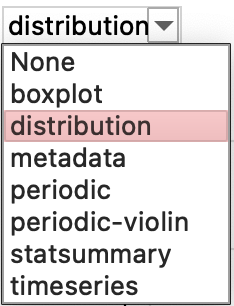

When at least one station is selected on the map, four other plots will be visible.

Each plot (except the map) can be switched to a different plot, by clicking the drop-down menu in the top left of each plot. A plot can also be deactivated entirely by clicking **None**.

See here for more information about all available [plot types](Plot-types-and-options), and see here for more information about [plot customisation](Plot-customisation).

### Plot settings

Each plot will be accompanied with two buttons in the top right corner of the plot.

The first icon is a save button which allows individual plots to be saved as a figure. 

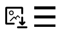

The second is a burger menu icon, which after clicking reveals a plot settings menu, where multiple options to interactively customise the plot are revealed (e.g. point size, or smoothing for the timeseries).

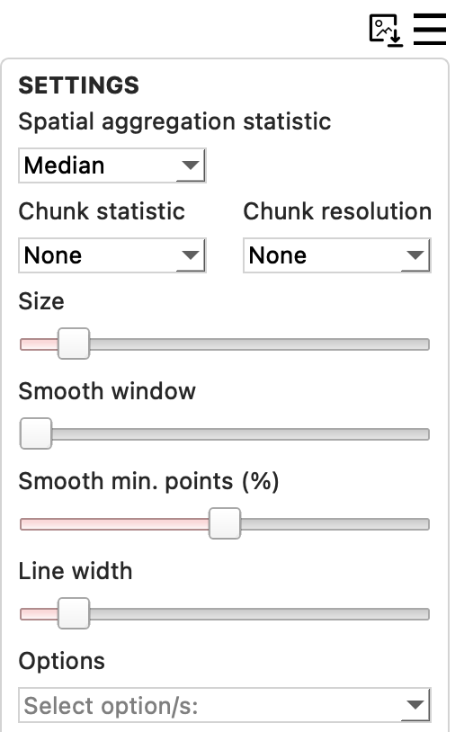

At the bottom of the settings window is a drop-down menu for plot options, where by selecting one or more of these options you can dramatically alter the plot in some way. 

One major plot option to note is **bias**. By selecting **bias** what is plotted is the result of the model - observations (i.e. bias). On the map, rather than selecting **bias** as a plot option, it can be obtained by selecting a secondary dataset. The bias will be calculated by the two active datasets.

On some plots, the plotted statistic can also be altered though the settings menu, e.g. **periodic**.

See here for more information about all available [plot options](Plot-types-and-options).

### Legend

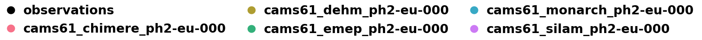

The legend in the upper right of the dashboard displays which data is currently loaded on the dashboard (observations and model names). The legend is interactive, so by clicking on any data type, the respective data for that type will be hidden, or shown, on all plots.
