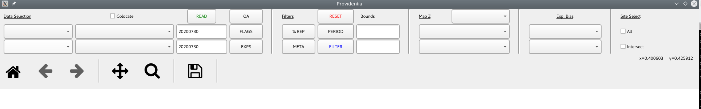

# FAQ

If you encounter any error, please check the FAQ. For other problems, you can create an issue in GitLab or contact us directly.

## Providentia's graphic interface appears distorted/magnified

For some particular cases, it can happen that when the application is launched, the graphics of the tools appear weird, as if magnified, like in the following picture:



The solution to this issue is running the command `export QT_AUTO_SCREEN_SCALE_FACTOR=0` before you launch the application. So, you need to execute something like the following:

```
source load_modules.sh
export QT_AUTO_SCREEN_SCALE_FACTOR=0
./bin/providentia
```

## ModuleNotFoundError: No module named 'configargparse' on workstations

This indicates that the modules have not been loaded, at this moment Providentia cannot be used from the workstations.

## salloc: error: x11_get_xauth: Could not retrieve magic cookie. Cannot use X11 forwarding.

When this error occurs, you should go to your home directory, remove .Xauthority file and then reconnect with ssh.

## Fatal error when cloning Providentia on HPC

This error here:

```
fatal: unable to access 'https://earth.bsc.es/gitlab/ac/Providentia.git/': Failed to connect to earth.bsc.es port 443: Connection timed out
```

happens when you connect to a node that has no internet connection. If you are on MN5, try cloning Providentia from glogin4, the only one that can connect.

## HDF error on HPC

On days where gpfs is full and there is no available disk space, we get this error when trying to interpolate. To avoid this, we recommend using Providentia locally. These are the steps to be followed:

* Clone the Providentia repository using `git clone https://earth.bsc.es/gitlab/ac/Providentia.git`.
* Open the dashboard using `/bin/providentia`, this will create the conda environment in your machine.
* Add your experiment ID in `settings/interp_experiments.yaml` so that Providentia can know where to download the data from.
* Add `interpolated=False` in your configuration file to indicate that you want to download data that has not yet been interpolated.
* Use the [download mode](Download) to download the observations and experiments to interpolate by `./bin/providentia --config='/path/to/file/example.conf' --download`. If you get an authentication error, review the .env file and redefine the username and password to access storage5 (PRV_USER, PRV_PWD).
* After downloading the data do the interpolation as usual: `./bin/providentia --config='/path/to/file/example.conf' --interp`.

## Unknown Miniconda3/23.9.0-0 on Nord4

When using Providentia in Nord4 you might get this error:

```
INFO: Running on nord4...
Lmod has detected the following error:  The following module(s) are
unknown: "Miniconda3/23.9.0-0"
Please check the spelling or version number. Also try "module spider ..."
It is also possible your cache file is out-of-date; it may help to try:
  $ module --ignore-cache load "Miniconda3/23.9.0-0"
```

To avoid this issue, remember that you need to edit your .bashrc file in /home/bsc/{username} as specified in the [Connection setup section](Connection-setup)

## Could not load the Qt platform plugin "xcb" on HPC

When testing new machines and attempting to opening the dashboard for the first time, for example Grace and the operational runs machine, we encountered this error:

```
qt.qpa.plugin: Could not load the Qt platform plugin "xcb" in "" even though it was found.
This application failed to start because no Qt platform plugin could be initialized. Reinstalling the application may fix this problem.

Available platform plugins are: eglfs, linuxfb, minimal, minimalegl, offscreen, vnc, wayland-egl, wayland, wayland-xcomposite-egl, wayland-xcomposite-glx, webgl, xcb.

./bin/providentia: line 542: 388441 Aborted                 (core dumped) python3 -u -Wi -c 'from providentia import main;main.main()'
```

To solve it you must have sudo permissions and install in your system:
```
sudo dnf libxcb xcb-util xcb-util-image xcb-util-keysyms xcb-util-renderutil xcb-util-wm libxkbcommon libxkbcommon-x11
```

These are the names for Rocky Linux.

## Segmentation fault on Nord4

This error appears when slurm is not able to submit the job properly. This is not a problem of Providentia, but of the machine. Try again, change machines or work locally.

## Creating environment using environment.yml

If for some reason you want to create the environment from scratch, you can use:

```
conda env create -f environment.yaml
```

You might get a warning like:

```
WARNING conda.models.version:get_matcher(556): Using .* with relational operator is superfluous and deprecated and will be removed in a future version of conda. Your spec was 1.6.0.*, but conda is ignoring the .* and treating it as 1.6.0
```

This can be removed by updating conda:

```
conda update conda
conda install -n base conda=24.4.0 conda-build=24.3.0
```

Check what the latest versions of [conda](https://github.com/conda/conda/releases) and [conda-build](https://github.com/conda/conda-build/releases) are.