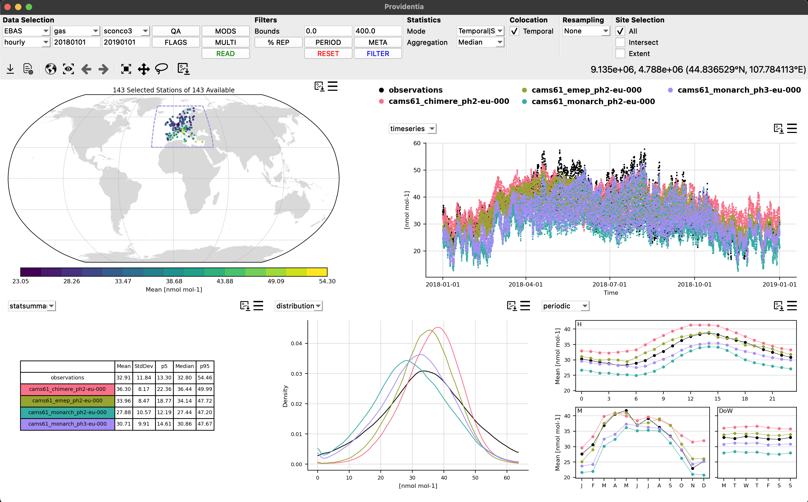
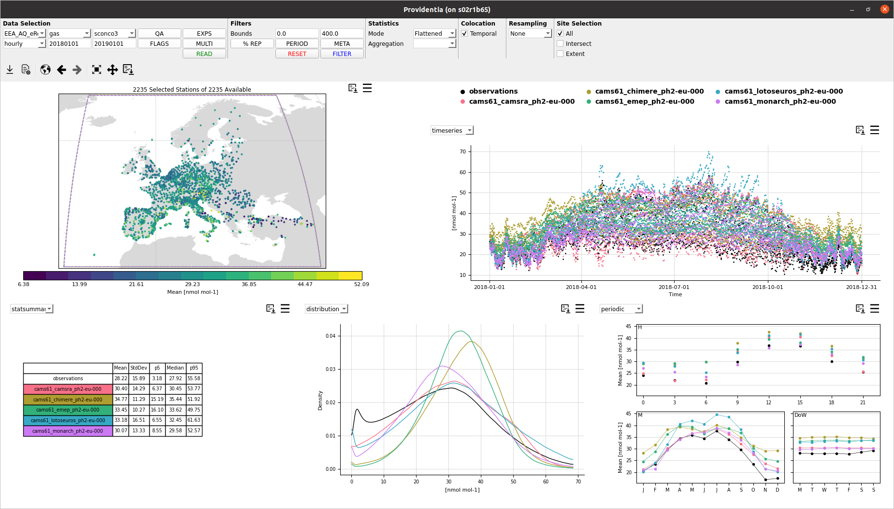
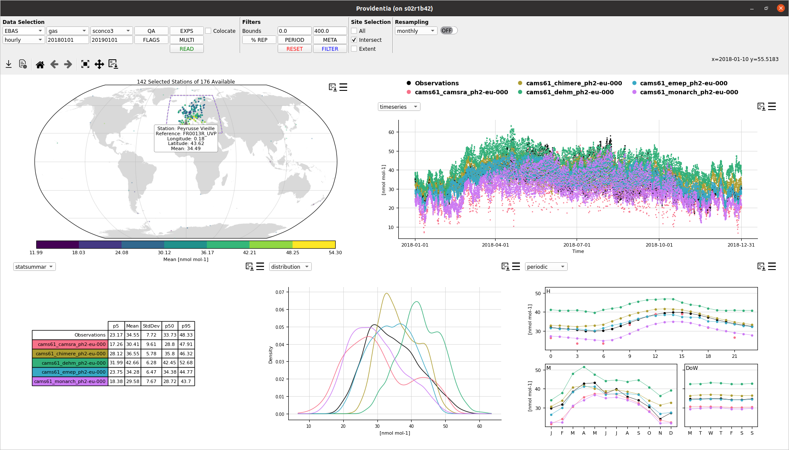
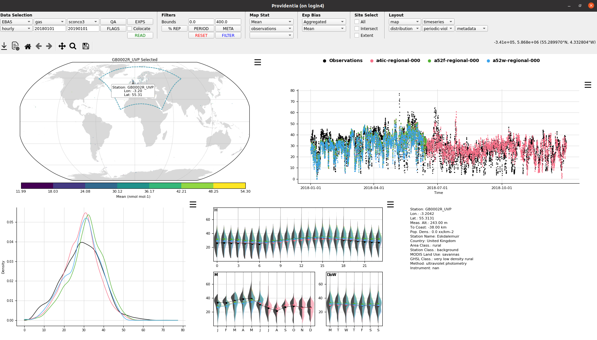
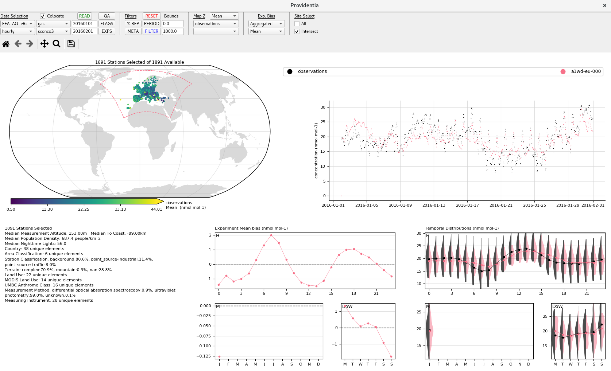

# History of Providentia

Providentia was first created in August 2019 by Dene Bowdalo as an internal tool at the Barcelona Supercomputing Center for quickly evaluating modelled atmospheric chemistry data. It has grown substantially over the years, with it going public in January 2026.

This [presentation](uploads/presentations/Providentia_History.pdf) gives an overview of its development over the years.

## Visual Evolution

Providentia when first conceived first only had a dashboard, the follow graphics show how that dashboard has changed over the years: 

### Version 3.0.0 (2026)

### Versions 2.2.0 and 2.2.1 (2023)

### Version 2.1.0 (2023)

### Version 2.0.0 (2022)

### Version 1.3.0 (2020)

