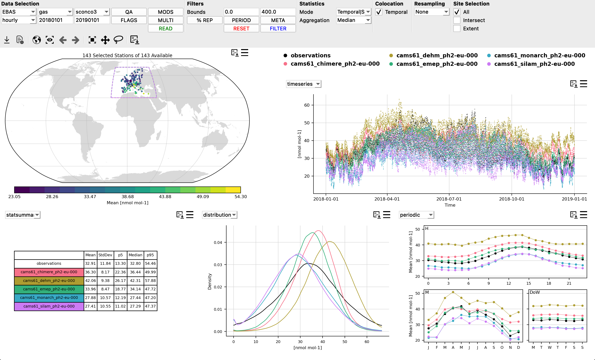

# Home

## Description

Providentia can be used in a variety of ways:

* [Interpolation](Interpolation), to interpolate the models to the observations networks of your interest. 
* [Dashboard](Dashboard), designed to allow on-the-fly analysis of BSC model output.
* [Report](Report), designed to obtain complete reports and carry out in-depth analysis of BSC model output.
* {ref}`Download <default-download>`, to download data from esarchive and Zenodo into your local directories.
* [Library](Library), allowing use of the Providentia backend functions, and use within your own scripts.

### Training sessions

Below you will find the recorded videos of the last training sessions, as well as the presentations:

* 18/02/2025: [Presentation](uploads/presentations/20250218_Providentia_Training_Session.pdf) and [video](https://www.youtube.com/watch?v=5PUX9KfaI0w)

* 16/10/2023: [Presentation](uploads/presentations/20231016_Providentia_Training_Session.pdf) and [video](https://youtu.be/G-L2VohxSz8?si=8qrMDHvhmP6i-QTX)

* 29/09/2022: [Presentation](uploads/presentations/20220929_Providentia_Training_Session.pdf) and [video](https://youtu.be/jijPmbvCYgo)

* 22/09/2022: [Presentation](uploads/presentations/20220922_Providentia_Training_Session.pdf) and [video](https://youtu.be/Mz6KFAvEtKA)

* 24/03/2021: [Presentation](uploads/presentations/20220422_Providentia_Training_Session.pdf) and [video](https://www.youtube.com/watch?v=Pu_kXjHM1nw)

### User meetings

Below you will find the presentation of the last user meetings:

* 28/08/2024: [Presentation](uploads/presentations/20240828_Providentia_User_Meeting.pdf) and [video](https://www.youtube.com/watch?v=TCgAFlwRYZk)

* 07/02/2024: [Presentation](uploads/presentations/20240207_Providentia_User_Meeting.pdf) and [video](https://www.youtube.com/watch?v=sQrILt4udOU)

* 03/08/2023: [Presentation](uploads/presentations/20230803_Providentia_User_Meeting.pdf) and [video](https://www.youtube.com/watch?v=2cJbp772pu0)

* 23/03/2023: [Presentation](uploads/presentations/20230323_Providentia_User_Meeting.pdf)

## External Sessions

Below you will find relevant external webinars or presentations.

* 05/06/2025: [Presentation](uploads/presentations/20250605_Providentia_ACTRIS_DC_Workshop.pdf)

## Contact persons

Code developed by [Barcelona Supercomputing Centre](https://www.bsc.es/) (BSC-CNS).

Developers:

* [Dene Bowdalo](https://www.bsc.es/bowdalo-dene) (dene.bowdalo@bsc.es) - Active
* [Alba Vilanova](https://www.bsc.es/vilanova-cortezon-alba) (alba.vilanova@bsc.es) - Active
* [Paula Serrano](https://www.bsc.es/serrano-sierra-paula)(paula.serrano@bsc.es) - Active
* Amalia Vradi (amalia.vradi@bsc.es)
* [Francesco Benincasa](https://www.bsc.es/benincasa-francesco) (francesco.benincasa@bsc.es)