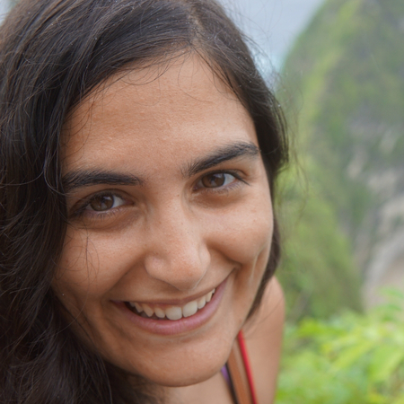
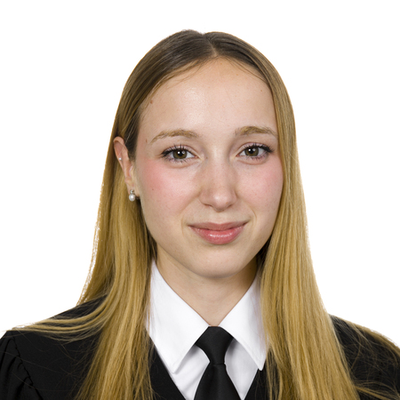
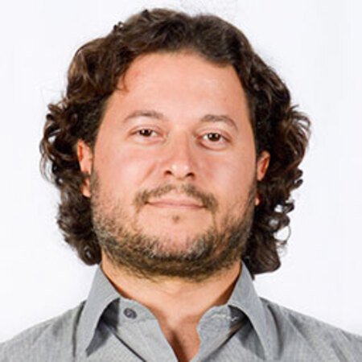
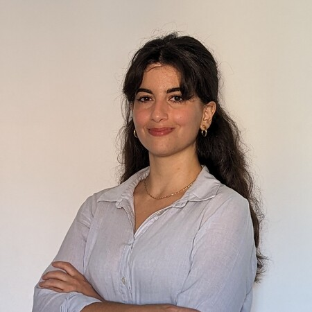

# Meet the Team

## Current Team

### Dene Bowdalo

**Established Researcher**  

Dene is a researcher in the Atmospheric Composition group. Dene created Providentia in August 2019, beginning with just the dashboard, and has been an active developer and coordinator of the tool since.

[LinkedIn](https://www.linkedin.com/in/denebowdalo/) | [Email](mailto:dene.bowdalo@bsc.es)

### Alba Vilanova Cortezón

**Research Engineer**  

Alba is a member of the Data and Diagnostics Team inside Computational Earth Sciences. She has been working on Providentia since March 2022 up until today. Her main work on Providentia has been the development of the Report mode.

[LinkedIn](https://linkedin.com/in/albavilanova) | [Email](mailto:alba.vilanova@bsc.es)

### Paula Serrano Sierra

**Junior Research Engineer**  

Paula is a member of the Data and Diagnostics Team inside Computational Earth Sciences. She has been working on Providentia since March 2024 up until today. Her main work on Providentia has been the development of the Download mode.

[LinkedIn](https://linkedin.com/in/paula-serrano-sierra/) | [Email](mailto:paula.serrano@bsc.es)

## Former Team Members

### Francesco Benincasa

**Senior Research Engineer**  

Francesco is the team leader of the Data and Diagnostics Team inside Computational Earth Sciences. He worked in Providentia from November 2019 to February 2020, developing the launching and argument parser when Providentia was first starting.

[LinkedIn](https://www.linkedin.com/in/fbenincasa/) | [Email](mailto:francesco.benincasa@bsc.es)

### Amalia Vradi

**Research Engineer**  

Amalia is a former BSC employee. She was the first dedicated Providentia developer, who had the unenviable task of refactoring the Providentia code when it was just starting out.

[LinkedIn](https://www.linkedin.com/in/amaliavradi/)