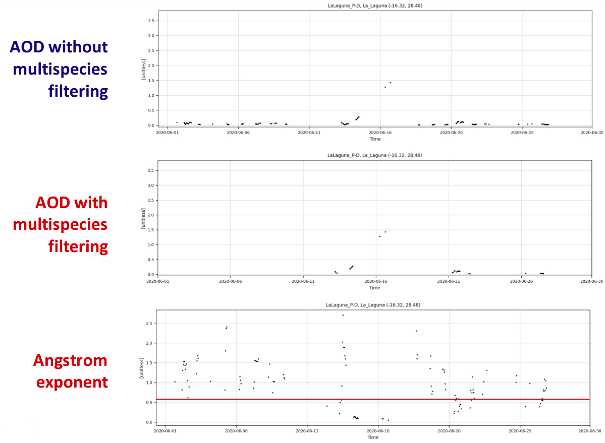
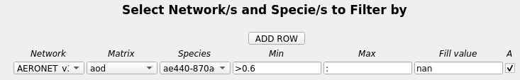

# Multispecies filtering

Multispecies filtering refers to the ability to filter the currently selected species by the values of another species, which can be given by the current network or by an external one.

In the reports created to study the dust in the atmosphere it is common practice to filter the optical depth by the Angstrom exponent to know which values are associated with dust. For instance, we can use the values of the Angstrom exponent above 0.6 to filter the AOD.

If we take a look at the timeseries for one station, we can see what this actually means:



It can be observed that there are less data points for the AOD after the filtering is applied and the removal of those happens when the Angstrom exponent is higher than 0.6.

This can easily be done by using the `MULTI` menu in the dashboard or by defining the `filter_species` variable in our configuration files. The equivalent of this in the reports:

```
[All]
network = AERONET_v3_lev1.5
species = od550aero
filter_species = AERONET_v3_lev1.5:ae440-870aero (>0.6, :, nan)
spatial_colocation = True
...
```

would be in the dashboard:



`NOTE: Spatial colocation must be turned on in order to apply multispecies filtering. In the dashboard, it is active by default.`

It also possible to apply more than one filter at the same time, e.g.:

```
network = nasa-aeronet/directsun_v3-lev15
species = od550aero
filter_species = nasa-aeronet/directsun_v3-lev15:ae440-870aero (>0.75, <=1.2, nan), nasa-aeronet/directsun_v3-lev15:ae440-870aero (>1.2, :, 0)
spatial_colocation = True
...
```

In this case, we would be converting the data of AOD above 1.2 to 0, and removing the data between 0.75 and 1.2.