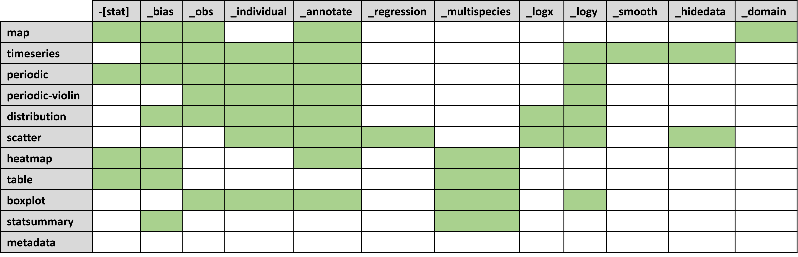

# Offline reports

Providentia's offline mode was designed to be able to generate complete reports and carry out in-depth analysis of BSC experiment output, with respect to GHOST processed observational data.

## Plot types and options



The offline report has access to a larger variety of plot types than the standard interactive version of Providentia. Each available plot type is listed here:

* map `-[stat]` `_bias` `_obs` `_annotate` `_domain`

* timeseries `_bias` `_obs` `_individual` `_annotate` `_logy` `_smooth` `_hidedata`

* periodic `-[stat]` `_bias` `_obs` `_individual` `_annotate` `_logy`

* periodic-violin `_obs` `_individual` `_annotate` `_logy` 

* distribution `_bias` `_obs` `_individual` `_annotate` `_logx` `_logy` 

* scatter `_individual` `_annotate` `_regression` `_logx` `_logy` `_hidedata`

* heatmap `-[stat]` `_bias` `_annotate` `_multispecies`

* table `-[stat]` `_bias` `_multispecies`

* boxplot `_obs` `_individual` `_annotate` `_multispecies` `_logy`

* statsummary `_bias` `_multispecies`

* metadata

The meaning of each of these additional words (`_obs`, `_individual`, `_annotate`, etc.) can be found in [Plot types and options](Plot-types-and-options).

## Plot selection
You should edit the file `settings/plots_per_report_type.yaml` and add a new dictionary key with the names of the plots you want to have. For instance, if you want to include timeseries and scatter plots with and without annotations in your report, you should add:

```
"new_plots": ["timeseries", "timeseries_annotate", 
              "scatter", "scatter_annotate"
             ]
```

The plots will appear in the report in the given order. The key name `new_plots` can be changed and should be applied by defining the `report_type` parameter in the [configuration file](Configuration-files):

```
report_type = new_plots
```