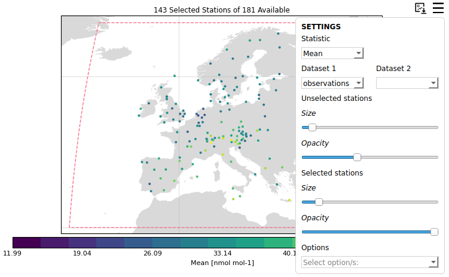
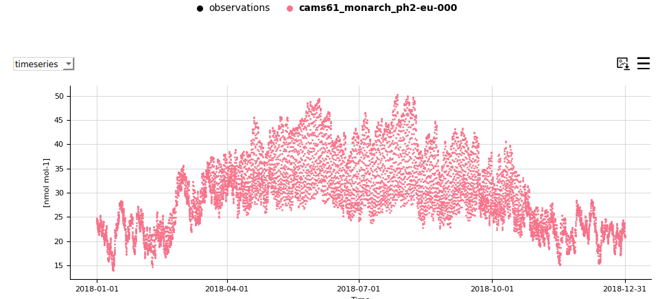
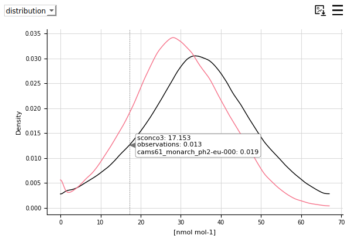
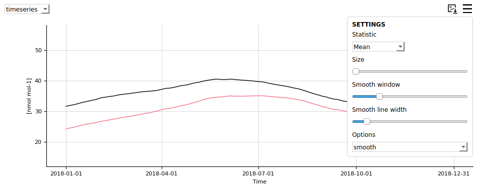

# Plot customisation

## Editing the plot style from the configuration files

If you want to edit the style of your plots, you will need to **edit it in one of the following files** and launch the tool again:

* Plots in the dashboard: `settings/plot_characteristics_dashboard.yaml`
* Plots in the offline reports: `settings/plot_characteristics_offline.yaml`
* Plots in the interactive mode: `settings/plot_characteristics_interactive.yaml`

### Setting the map coastline resolution

It is possible to customise the map coastline resolution by changing the `map_coastline_resolution` variable under the `map` section in the appropriate plot characteristics file. 

There are 3 options as present:
- `low`: 110m in resolution
- `medium`: 50m in resolution
- `high`: 10m in resolution

### Setting the map background

Users can define the type of background that is plotted on the map. This can be set by changing the background variable under the `map` section in the appropriate plot characteristics file.

There are 3 available standard options:
- `providentia`: The standard white and grey combination that has been historically available. *Default
- `blue_marble`: NASA's blue marble product
- `shaded_relief`: imagery showing changes in elevation 

Users can easily add any type of background by putting an image file in the `providentia/dependencies/resources` folder, with the filename named in the same way as in the plot characteristics file, e.g. `blue_marble.png` and `"background": "blue_marble"`. 

### Setting custom bounds and cmap per species

Users can define the color and bounds of the colorbar (cmap, vmin and vmax) per species using a dictionary, with the keys being the names of the species inside `basic_stats.yaml` and `experiment_bias_stats.yaml`. An example can be seen in the code below:

```
"Mean":        {"function": "calculate_mean", 
                "order": 0, 
                "label": "Mean", 
                "arguments": {}, 
                "units": "[measurement_units]", 
                "minimum_bias": [0.0],
                "vmin_absolute": {"sconco3": 0, "sconcno2": 0},
                "vmax_absolute": {"sconco3": 20, "sconcno2": 5}, 
                "vmin_bias": {}, 
                "vmax_bias": {},
                "cmap_absolute": "viridis",
                "cmap_bias": "RdYlBu_r"},
```

If they define the cmap, they will need to give a complete list of cmap options for each of the species that they load or otherwise a warning will appear. For vmin and vmax, they can define the bounds for some species and the rest will take the data minimum and maximum values.

### Remove extreme stations by their statistical values

If you want to automatically remove stations that have certain statistical values, you will need to add your criteria in the file `settings/remove_extreme_stations.yaml`. An example of this exists for `CAMS`:

```
"CAMS": {"r": ["<0.3"],
         "NMB": ["<-100.0", ">100.0"],
         "NRMSE": [">100.0"]}
```
The statistics can be general, across all components, or they can be specific per component, for example:

 ```
"CAMS": {"r": {"sconco3": ["<0.3"], 
                "sconcno2":[<0.55]},
         "NMB": {"sconco3": ["<-100.0", ">100.0"], 
                 "sconcno2": ["<-20.0", ">20.0"]},
         "NRMSE": {"sconco3": [">100.0"], 
                   "sconcno2":[">200.0"]}}
```

Any absolute statistic can be set to be a bias statistic by adding `_bias` e.g.: 
 
```
"p95_bias": ["<10",">20"]
```

You will also need to add the variable `remove_extreme_stations` in your configuration file, referencing the group of statistics to filter by that you defined, e.g. `CAMS`:

```
remove_extreme_stations=CAMS
```
### Calculating exceedances

In Providentia the `exceedances` statistic is available in the list of available statistics. How it is currently implemented is simplistic, but users can simply state a threshold/limit value per component or network-component pair, and each instance where values exceed this limit will be counted. Therefore the `exceedances` statistic simply gives the number of instances above the threshold. The threshold values can be set in the file `settings/exceedances.yaml` per component, or network-component pair, as so: 

```
{"sconco3": 90.21, 
 "sconcno2": 106.38,
 "EBAS|sconco3": 109.77,
 "EBAS|sconcno2": 88.88}
```
In the case a threshold is set for a specific component, and per network-component, then the threshold for network-component is taken preferentially.   

## Editing the plot style in the dashboard

### Changing the plot style

The style of the plots can be edited by clicking on the burger menus and changing the settings.



### Legend picking

Clicking on the legend labels will remove or add data to each of the plots. If the label appears in bold, the data will be visible. If not, it will disappear.



### Changing the statistics

The statistics in the `statsummary` can be updated from the burger menu.


### Information on hover

Most plots show information when hovering over them. Take a look for instance at the distribution plot:



### Smoothing

It is possible to add a smoothing line to the timeseries plot and make the points disappear. In order to achieve this, you will need to increase the smooth window, which by default is 0 and bring the marker size down to 0. You can also use the plot option `hidedata` to hide the points. 

