# Plot types and options

Users can choose which plots their reports will have from the options below.

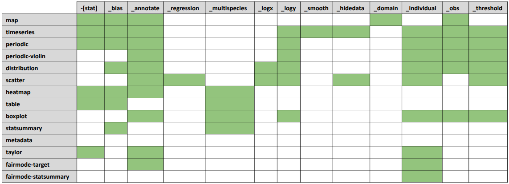

## Plot types

The standard plot types consist of:

- Map (`map`)
- Metadata summary (`metadata`)
- Timeseries (`timeseries`)
- Periodic plot (`periodic`)
- Periodic violin plot (`periodic-violin`)
- Box plot (`boxplot`)
- Distribution plot (`distribution`)
- Scatter plot (`scatter`)
- Heat map (`heatmap`)
- Table that gives one stat per subsection per experiment (`table`)
- Table that gives multiple stats per experiment (`statsummary`)
- Taylor Diagram (`taylor`)
- FAIRMODE target plot (`fairmode-target`)
- FAIRMODE statistics summary plot (`fairmode-statsummary`).

Some of these plots are created for specific statistics, namely: `map`, `periodic`, `heatmap`, `taylor` and `table`. This statistic is defined by aggregating the `-[stat]` field to the plot type. `[stat]` should be replaced with any of the base statistic names (e.g. p5, Mean), or experiment bias names (e.g. r2, RMSE). For example to show the median values spatially, `map-p50` would be set as the plot name, or `map-r2` to show the coefficient of determination. The available statistic names are documented in `settings/basic_stats.yaml` and `settings/experiment_bias_stats.yaml`. For the Taylor diagram, only `r`and `r2`can be used.

The timeseries can also be used to show how statistics vary in time. In order to do this, we need to add `-[stat]` and the temporal resolution after the plot type name (e.g. `timeseries-Mean-daily`, `timeseries-r2-monthly`, `timeseries-r-annual`).

For the `metadata` plot the metadata displayed is set to a default list of metadata fields. For the `statsummary` plot the statistics displayed are set to a default list of absolute and bias statistics. These default options can be changed in `settings/plot_characteristics.yaml`.

### Map (`map`)

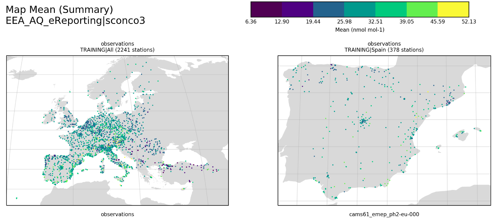

### Metadata (`metadata`)

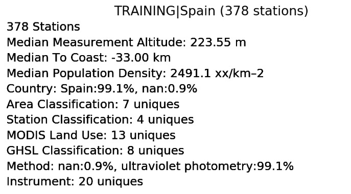

### Timeseries (`timeseries`)

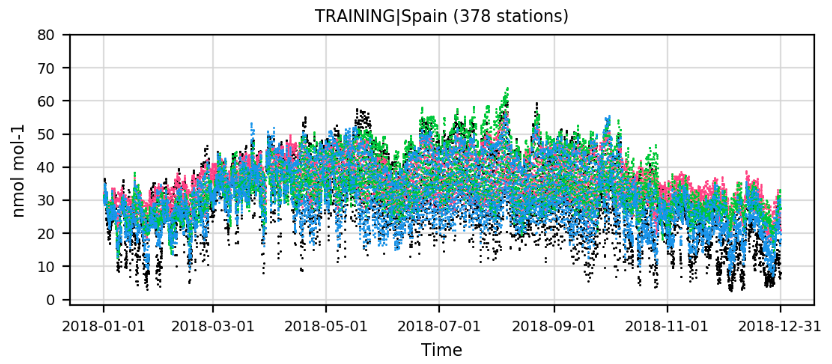

### Periodic (`periodic`)

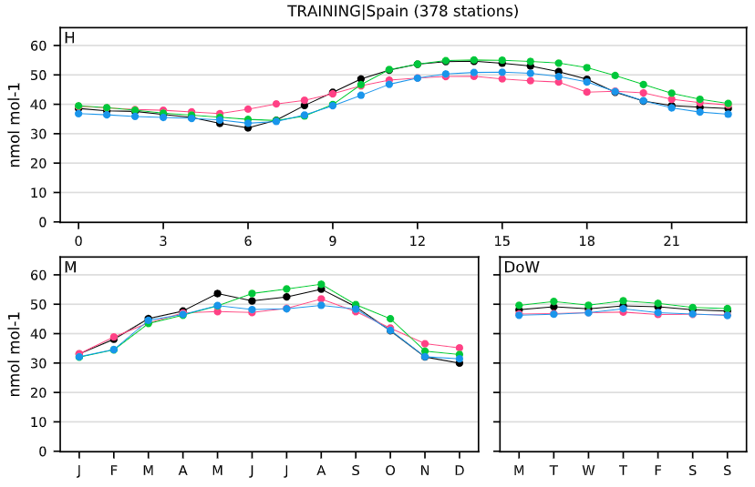

### Periodic violin (`periodic-violin`)

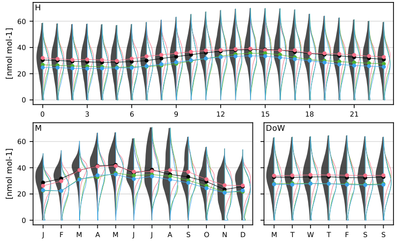

### Boxplot (`boxplot`)

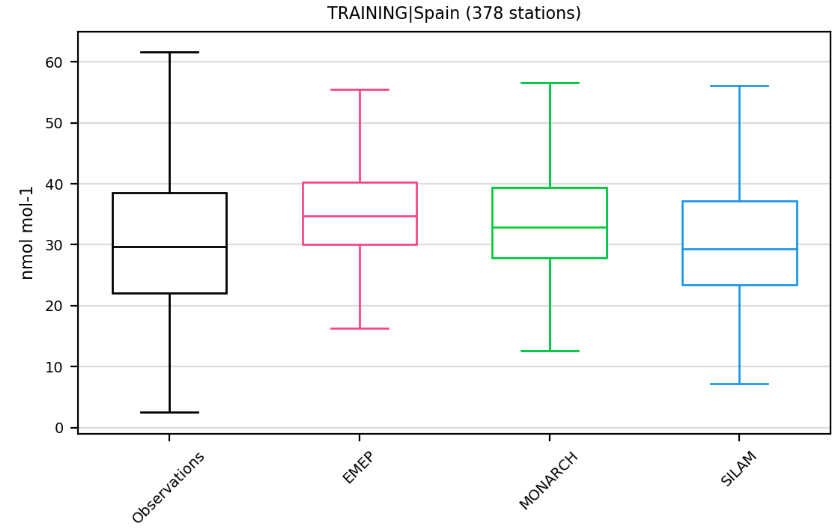

### Distribution (`distribution`)

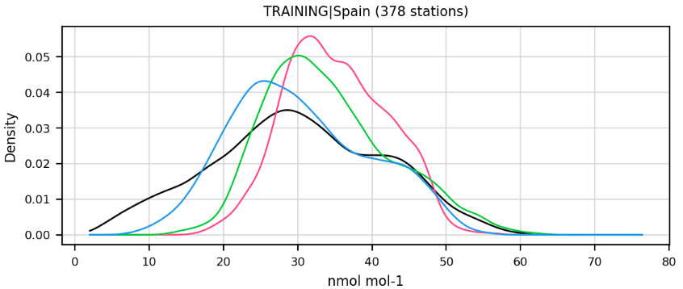

### Scatter plot (`scatter`)

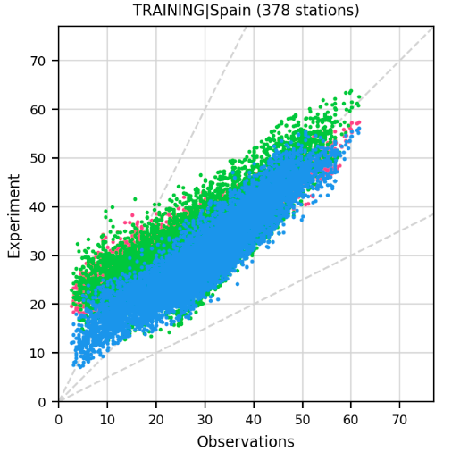

### Heatmap (`heatmap`)

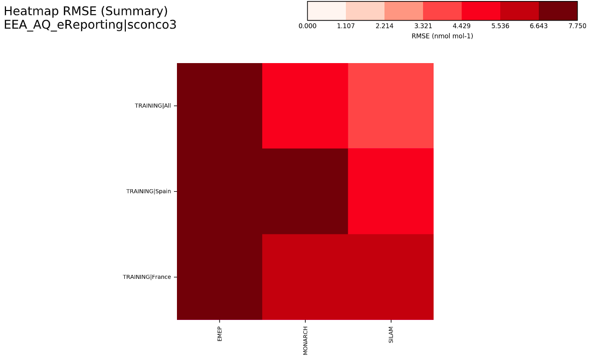

### Table (`table`)

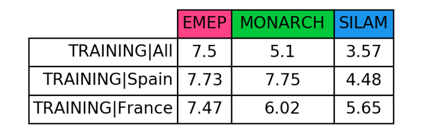

### Statistics summary (`statsummary`)

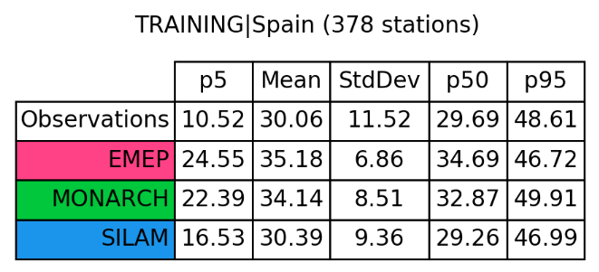

### Taylor diagram (`taylor`)

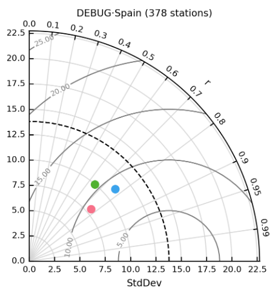

### FAIRMODE target (`fairmode-target`)

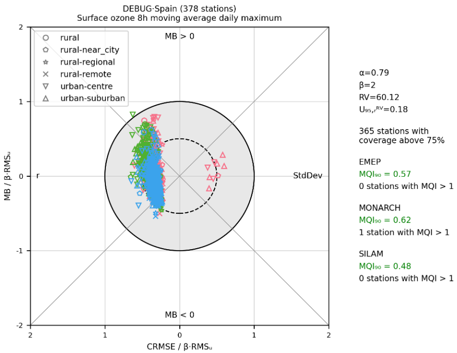

### FAIRMODE statistics summary (`fairmode-statsummary`)

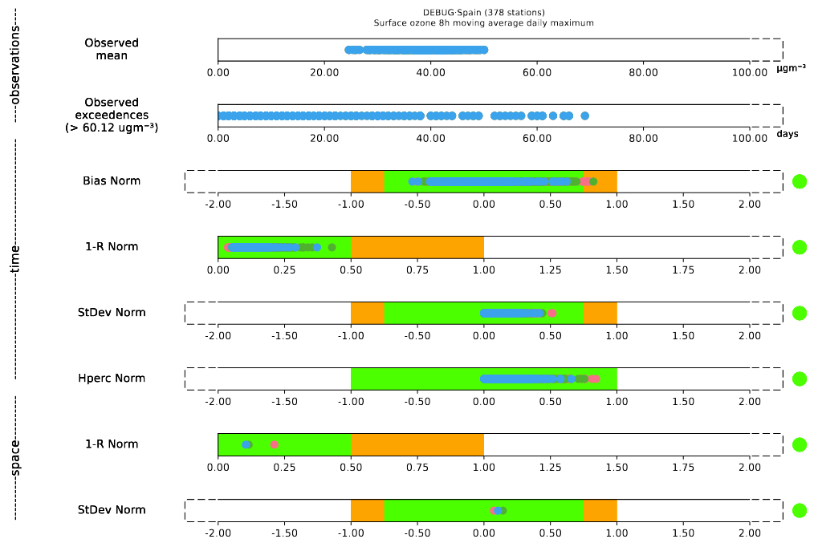

## Plot options

It is possible to create advanced plots by adding one or more of the following words to each basic plot type or choosing the options in the dashboard:

### Only show observations (`_obs`)

The extension `_obs` allows users to only show observations in their plots.

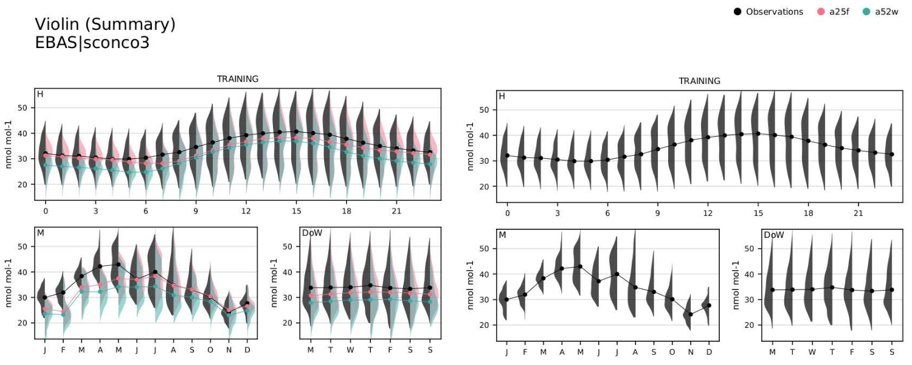

### Split the plots by label (`_individual`)

The extension `_individual` allows users to disaggregate the plots and see the plots by experiments, individually. This can help to visualise the results in a clear way when multiple experiments have been selected.

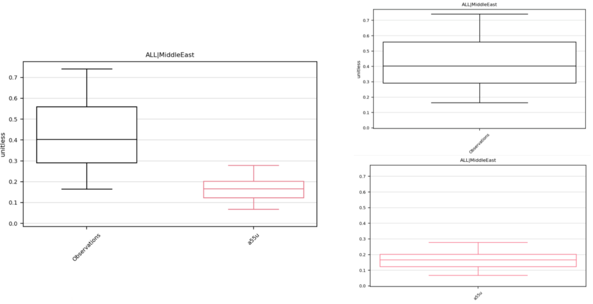

### Add annotations (`_annotate`)

If the configuration option `_annotate` is added, a box will be created on the plots to show several statistical data. The style and position of this box, as well as the statistics, can be defined by the user in `plot_characteristics.yaml` under `settings` by changing the parameter `annotate_stats` per plot type.

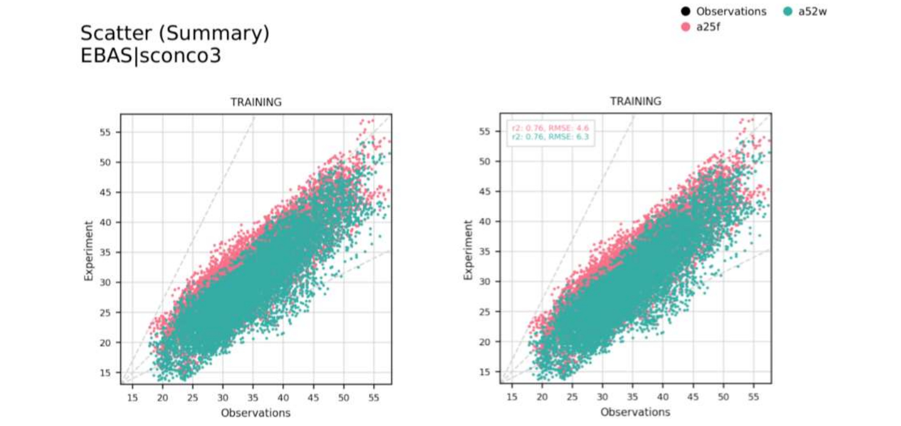

### Get the bias of the data (`_bias`)

Alternatively the plots can be modified to show, rather than the absolute observational vs experiment values, the bias between these pairings. This is done by adding `_bias` to the base plot names, for example: `distribution_bias` or `periodic-Max_bias`.

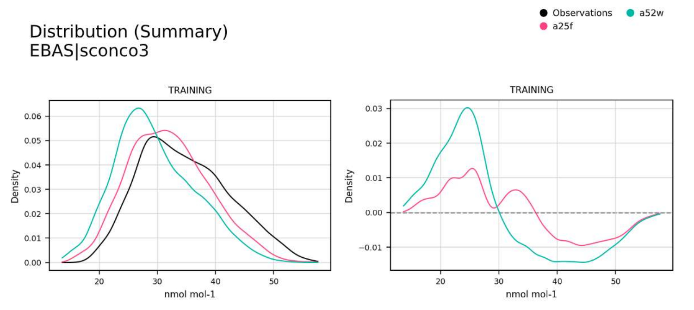

### Add a smooth line to the timeseries (`_smooth`)

Adding the option `_smooth` to the `timeseries` plot will plot a smooth line over the timeseries.

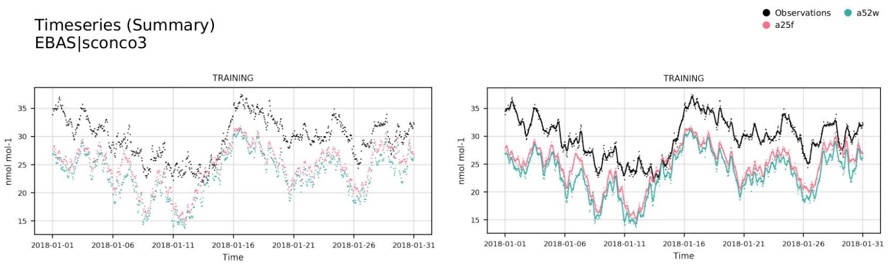

### Add a regression line to the scatter plot (`_regression`)

Adding the option `_regression` will plot the linear regression between observations and experiment.

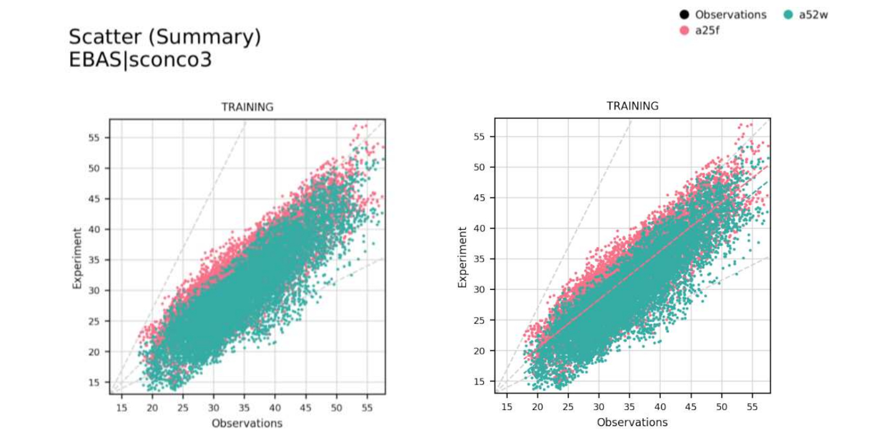

### Hide points and only show regression / smooth lines (`_hidedata`)

The option `_hidedata` needs to be accompanied by `_smooth` in the `timeseries` plot and by `_regression` in the `scatter` plot.

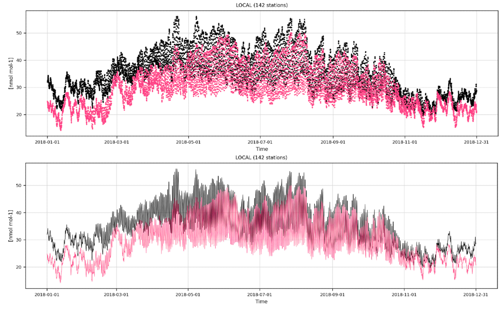

### Make the scale logarithmic (`_logx` / `_logy`)

Adding the options `_logx` or `_logy` will set the desired axis to be logarithmically scaled. 

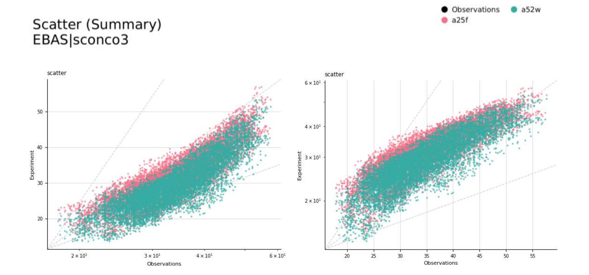

### Get plot by more than one network species (`_multispecies`)

Incorporate all read species in the plot type. 

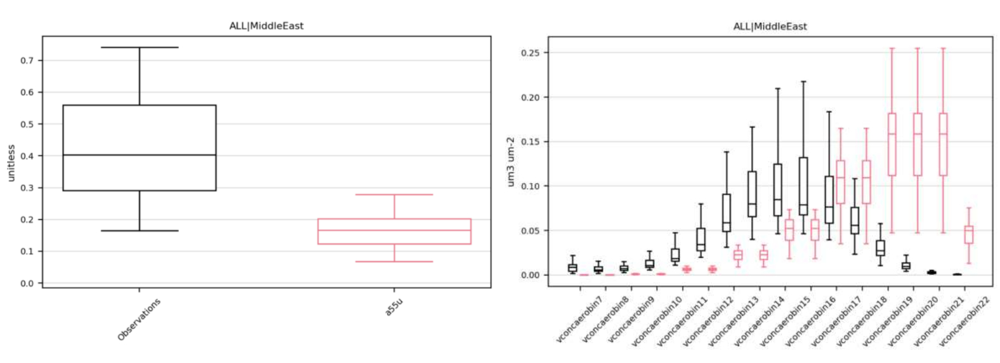

### Show the model grid in the maps (`_domain`)

Adding `_domain` will add the model grid on top of the map.

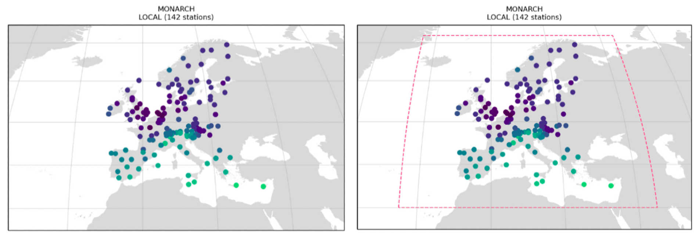

### Add threshold line (`_threshold`)

Adding `_threshold` will add a line indicating the exceedances. These exceedances are set in `settings/exceedances.yaml`.

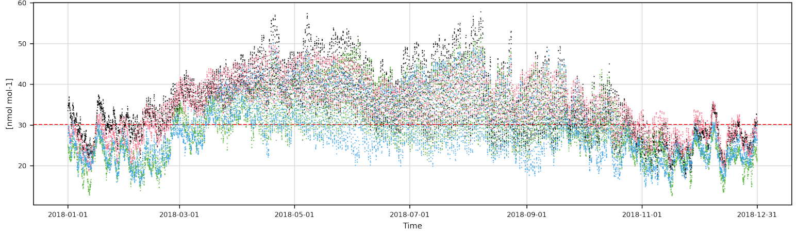