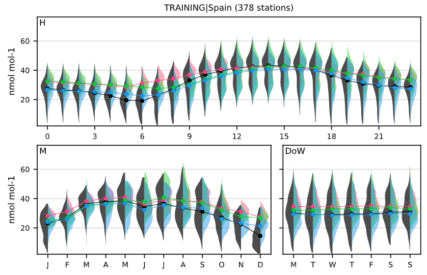
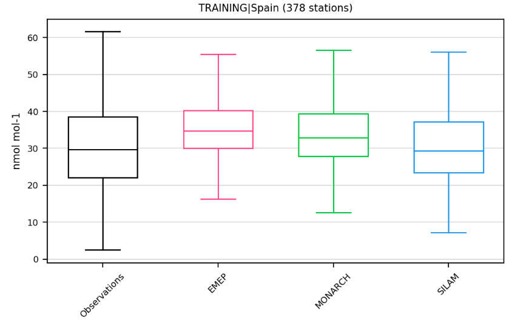
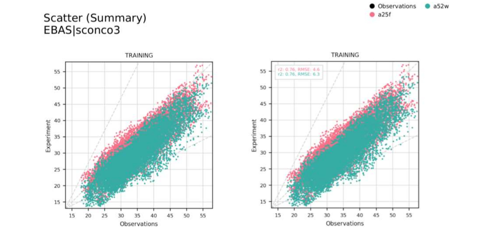
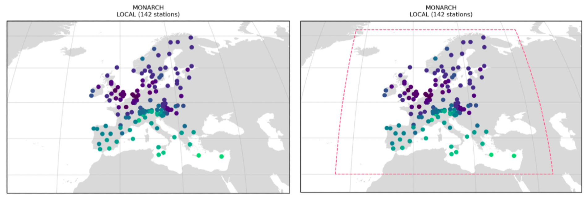

# Plot types and options

This page is only useful to those who want to create their own reports with the offline version. Users can choose which plots these reports will have, as you will see below.

## Plot types

The standard plot types consist of: maps (`map`), metadata summary (`metadata`), timeseries (`timeseries`), periodic plots (`periodic`), periodic violin plots (`periodic-violin`), box plots (`boxplot`), distribution plots (`distribution`), scatter plots (`scatter`), heat maps (`heatmap`), tables that give one stat per subsection per experiment (`table`) and tables that give multiple stats per experiment (`statsummary`).

Some of these plots involve calculating a specific statistic, namely: `map`, `periodic`, `heatmap` and `table`. This statistic is defined by aggregating the `-[stat]` field to the plot type will make a plot of the required type for the specific type of statistic set. `[stat]` should be replaced with any of the base statistic names (e.g. p5, Mean), or experiment bias names. For example to show the median values spatially, `map-p50` would be set as the plot name, or `map-r2` to show the coefficient of determination. The available statistic names are documented in `providentia/settings/basic_stats_dict.json` and `providentia/settings/experiment_bias_stats_dict.json` for reference.

For the `metadata` plot the metadata displayed is set to a default list of metadata fields. For the `statsummary` plot the statistics displayed are set to a default list of absolute and bias statistics. These default options can be changed in either the
`providentia/settings/plot_characteristics_dashboard.json` and `providentia/settings/plot_characteristics_offline.json` files, depending on which mode Providentia is being ran in.

### Map (`map`)

### Metadata (`metadata`)

### Timeseries (`timeseries`)

### Periodic (`periodic`)

### Periodic violin (`periodic-violin`)

### Boxplot (`boxplot`)

### Distribution (`distribution`)

### Scatter plot (`scatter`)

### Heatmap (`heatmap`)

### Table (`table`)

### Statistics summary (`statsummary`)

## Plot options

It is possible to create advanced plots by adding one or more of the following words to each basic plot type or choosing the options in the dashboard:

### Only show observations (`_obs`)

The extension `_obs` allows users to only show observations in their plots.

### Split the plots by label (`_individual`)

The extension `_individual` allows users to disaggregate the plots and see the plots by experiments, individually. This can help to visualise the results in a clear way when multiple experiments have been selected.

### Add annotations (`_annotate`)

If the configuration option `_annotate` is added, a box will be created on the plots to show several statistical data. The style and position of this box, as well as the statistics, can be defined by the user in plot characteristics under ``settings`` by changing the parameter `annotate_stats`.

### Get the bias of the data (`_bias`)

Alternatively the plots can be modified to show, rather than the absolute observational vs experiment values, the bias between these pairings. This is done by adding `_bias` to the base plot names, for example: `distribution_bias` or `periodic-Max_bias`.

### Add a smooth line to the timeseries (`_smooth`)

Adding the option `_smooth` to the `timeseries` plot will plot a smooth line over the timeseries.

### Add a regression line to the scatter plot (`_regression`)

Adding the option `_regression` will plot the linear regression between observations and experiment.

### Make the scale logarithmic (`_logx` / `_logy`)

Adding the options `_logx` or `_logy` will set the desired axis to be logarithmically scaled. 

### Get plot by more than one network species (`_multispecies`)

Incorporate all read species in the plot type. 

### Hide points and only show regression / smooth lines (`_hidedata`)

The option `_hidedata` needs to be accompanied by `_smooth` in the `timeseries` plot and by `_regression` in the `scatter` plot.

### Show the model grid in the maps (`_domain`)

Adding `_domain` will add the model grid on top of the map.

