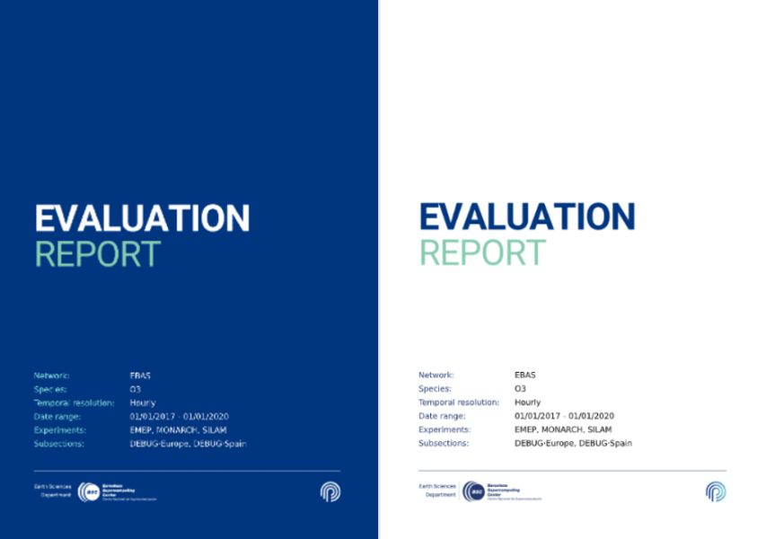

# Report

Providentia's report mode was designed to be able to generate complete reports and carry out in-depth analysis of BSC experiment output, with respect to GHOST processed observational data.

## Plot types and options

The report mode has access to a larger variety of plot types than the standard interactive version of Providentia. Each available plot type is listed in [Plot types and options](Plot-types-and-options).

## Plot selection
You should edit the file `settings/plots_per_report_type.yaml` and add a new dictionary key with the names of the plots you want to have. For instance, if you want to include timeseries and scatter plots with and without annotations in your report, you should add:

```
"new_plots": ["timeseries", "timeseries_annotate", 
              "scatter", "scatter_annotate"
             ]
```

The plots will appear in the report in the given order. The key name `new_plots` can be changed and should be applied by defining the `report_type` parameter in the [configuration file](Configuration-files):

```
report_type = new_plots
```

## Cover page



The cover page can be customised by editing the parameters under header in `settings/plot_characteristics.yaml` file. The most interesting ones are these:

- `dark_mode` to set the background to be dark (blue tone) or light (white).
- `variables` to specify which variables you want to show. The options are `network`, `species`, `resolution`, `dates`, `experiments`, `temporal_colocation`, `spatial_colocation`, `filter_species`, `calibration` and `subsections`. By specifying the `value` under those keys, you can overwrite the default variable values and write anything you want.
- `logo` to display any logo on your report cover. To use it, you must specify the path to your PNG file for the corresponding background (dark or light mode).