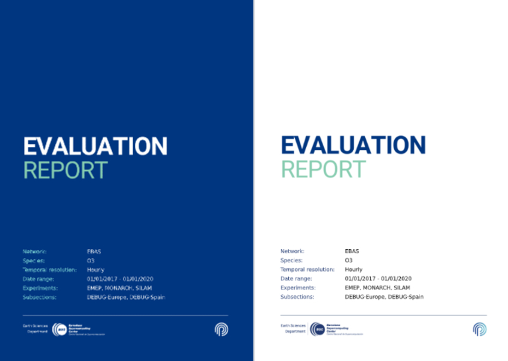
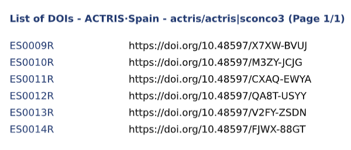

# Report

Providentia's report mode was designed to be able to generate complete reports and carry out in-depth analysis of BSC model output, with respect to observational data.

## Plot types and options

The report mode has access to a larger variety of plot types than the standard interactive version of Providentia. Each available plot type for the reports is listed in [Plot types and options](Plot-types-and-options).

## Plot selection

You should edit the file `settings/report_plots.yaml` and add a new dictionary key with the names of the plots you want to have. For instance, if you want to include timeseries and scatter plots with and without annotations in your report, you should add:

```
"new_plots": ["timeseries", "timeseries_annotate", 
              "scatter", "scatter_annotate"]
```

The plots will appear in the report in the given order, with the exception of `multispecies` plots, which will appear first. The key name `new_plots` will be used if called from the `report_type` parameter in the [configuration file](Configuration-files):

```
report_type = new_plots
```

## Summary and station plots

Users can specify if they want to see the plots as a summary for all the stations, or per station. This is set through the parameters `report_summary` and `report_stations`.

When a report has multiple subsections, summary plots will show data per subsection and data label, and station plots will show only data per label.

There is also the possibility to create some plots per station, and some only as a summary by using dictionaries in `settings/report_plots.yaml`. For instance, in the following example we would be creating timeseries station plots and scatter summary plots.

```
"new_plots": {"station": ["timeseries", "timeseries_annotate"], 
              "summary": ["scatter", "scatter_annotate"]}
```


## Cover page



The cover page can be customised by editing the parameters under header in `settings/plot_characteristics.yaml` file. The most interesting ones are these:

- `dark_mode` to set the background to be dark (blue tone) or light (white).
- `variables` to specify which variables you want to show. The options are `network`, `species`, `resolution`, `dates`, `experiments`, `temporal_colocation`, `spatial_colocation`, `filter_species`, `calibration` and `subsections`. By specifying the `value` under those keys, you can overwrite the default variable values and write anything you want.
- `logo` to display any logo on your report cover. To use it, you must specify the path to your PNG file for the corresponding background (dark or light mode).

## DOIs pages



When reading ACTRIS data, pages including the DOIs of the original datasets will be shown at the end of the report. Up to 30 references will be shown per page, depending on the `chunk_size` in `settings/plot_characteristics.yaml`.