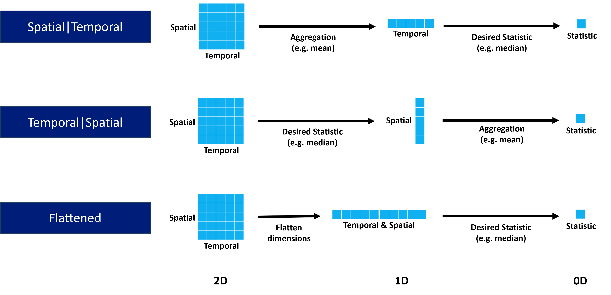
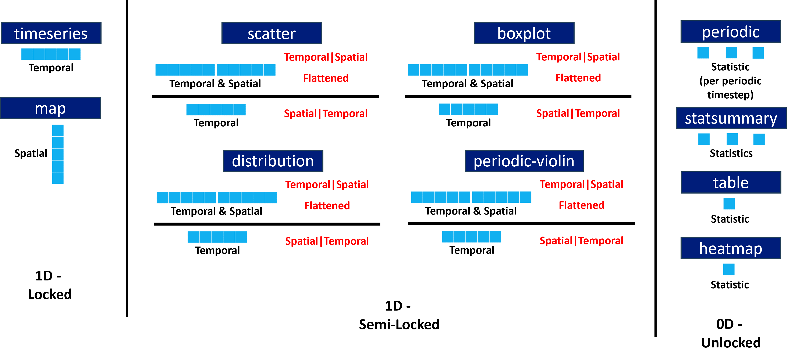

# Statistics

## Statistical modes

There are three statistical modes:

* Flattened (new default)
* Spatial|Temporal (Providentia versions before 2.2.0)
* Temporal|Spatial (CAMS / AEROVAL)

The name of each statistical mode relates to how the dimensions of the selected data are reduced to calculate the statistical metrics, e.g. mean, median etc, going from 2D to 0D.

When selecting data across multiple stations, it has 2 dimensions: 
Spatial and Temporal.

In the versions of Providentia prior to 2.2.0, the mode was always Spatial|Temporal, with aggregation performed across stations (e.g. taking mean across stations per timestep), going to 1D, before calculating the desired statistic across the aggregated timesteps (e.g. median), going to 0D.

### Dimensional reduction by statistical mode



### Dimensional reduction by statistical mode and plot type

For some plot types the full dimensional reduction is not possible, e.g map. Therefore, they are locked in certain reduction configurations. This is illustrated per plot type:



In both the dashboard and offline versions of Providentia, the statistical modes and aggregation statistics can be set.

On the dashboard, in the statistics tab at the top, the mode and aggregation can be selected via the dropdown menus. In the .conf file these can be set like so:

```
statistic_mode = Temporal|Spatial
statistic_aggregation = Median
```

NOTE: For the Flattened mode, there is no aggregation statistic.

## Periodic statistics

The periodic plot gives statistical information for grouped data in individual timesteps. Thus it can be seen how each individual timesteps compare for observations vs experiment/s.

However, when looking to evaluate the agreement across the whole of the periodic cycle, Providentia was previously lacking statistics to enable such a comparison.

Statistics can now be calculated which assess the available periodic cycles, i.e. diurnal, weekly, monthly. These statistics are available via the statsummary, table and heatmap plot types.

There exist 2 modes for calculating these periodic statistics: 
* Independent (default)
* Cycle

Independent works by calculating the desired statistic per timestep (i.e. as seen in periodic plot), before aggregating across the timesteps.

Cycle works by aggregating the grouped data per timestep (e.g. mean), before then calculating the desired statistic across the timesteps. 

Again, in both the dashboard and offline versions of Providentia, the periodic statistical modes and aggregation statistic can be set.

On the dashboard, in the plot options of the statsummary plot, the periodic statistic mode and aggregation can be selected via the dropdown menus. Additionally, periodic statistics can be added to the statsummary plot also via the dropdown menus.

In the .conf file these can be set like so:
```
periodic_statistic_mode = Independent
periodic_statistic_aggregation = Median
```