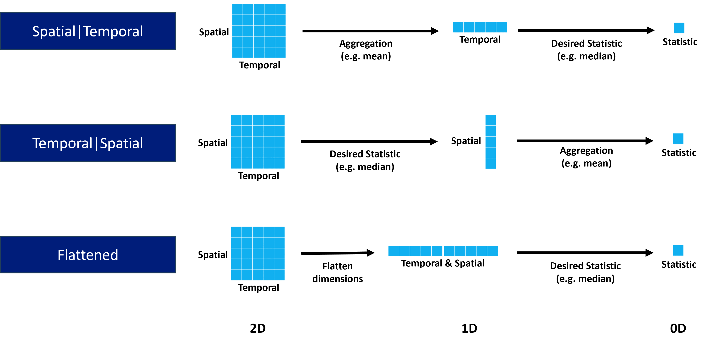
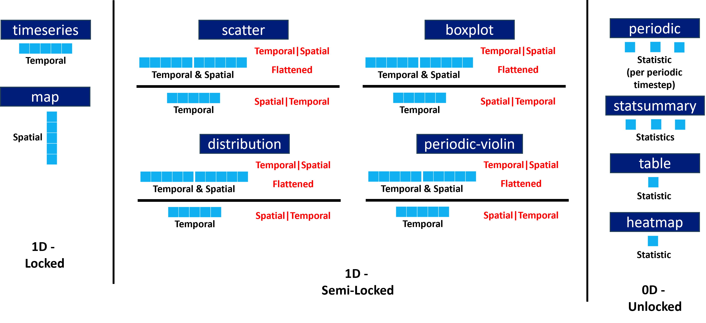

# Statistics

## Statistical modes

Statistics can be computed in numerous ways, which often leads to confusion when attempting to compare statistics when calculated by different sources. 

To aid with this, Providentia allows for flexibility in the calculation of statistics, with three different statistical modes:

* **Temporal|Spatial** 
* **Spatial|Temporal**
* **Flattened**

The name of each statistical mode relates to how the dimensions of the data are reduced to calculate the statistical metrics, e.g. mean, median etc, going from 2D to 0D.

For the **Temporal|Spatial** case, aggregation is first performed across time (e.g. taking median across time per station), going to 1D, before calculating the desired statistic across the stations (e.g. Min), going to 0D.

For the **Spatial|Temporal** case, aggregation is first performed across stations (e.g. taking median across stations per timestep), going to 1D, before calculating the desired statistic across the timesteps (e.g. Max), going to 0D.

For the **Flattened** case, rather than performing a two-step calculation, the dimensions are flattened to 1D first, by appending the data in one long array, then the desired statistic is directly calculated (e.g. StdDev), going to 0D. 

The default statistical mode is **Temporal|Spatial**, and the default aggregation statistic for the **Temporal|Spatial** and **Spatial|Temporal** modes is the **Median**. For the **Flattened** mode, there is no aggregation statistic.

The following graphic visually illustrates the dimensional reduction per mode: 



## Dimensional reduction by plot type

For some plot types the full dimensional reduction is not possible, e.g map. Therefore, they are locked in certain reduction configurations. This is illustrated for some example plot types:



## Setting statistical mode / aggregation

The statistical modes and aggregation statistics can be set in the configuration file like so:

```
statistic_mode = Temporal|Spatial
statistic_aggregation = Median
```
On the dashboard, in the statistics tab at the top, the mode and aggregation can be selected via the dropdown menus.

**NOTE**: For the **Flattened** mode, there is no **statistic_aggregation**, so setting it will have no effect when using that mode.

## Periodic statistics

The periodic plot gives statistical information for grouped data in individual periodic timesteps, e.g. per hour of the day. Thus it can be seen how each visually how statistics change over period cycles e.g. diurnal.

It is often desired however for a way to quantify how the statistics change over said periodic cycle. This can be done in Providentia through periodic statistics, and can be calculated for all available periodic cycles, i.e. diurnal, weekly, monthly.

There are two modes for calculating these periodic statistics: 

* **Independent**
* **Cycle**

**Independent** works by calculating the desired statistic (e.g. r) per periodic timestep (i.e. as seen on the periodic plot), before aggregating across the timesteps (e.g. median).

**Cycle** works by aggregating the grouped data per periodic timestep (e.g. median), before then calculating the desired statistic across the timesteps (e.g. MB). 

The default periodic statistic mode is **Independent**, and the default periodic statistic aggregation is **Median**.

As these resultant statistics are all 0D, the plots that these statistics can be used in are all 0D plot types: **statsummary**, **heatmap**, **table**. 

Again the periodic statistics mode and aggregation can be set in the configuration file as follows:

```
periodic_statistic_mode = Independent
periodic_statistic_aggregation = Median
```

On the dashboard, in the plot options of the statsummary plot, the periodic statistic mode and aggregation can be selected via the dropdown menus. Additionally, periodic statistics can be added to the statsummary plot also via the dropdown menus.

(available_statistics)= 
## Available statistical metrics

Providentia statistical metrics come in two categories: **basic** and **model bias**. 

Basic statistics are calculated independently for observational and model datasets. The available ones are:

| Statistic                                 | Meaning |
| ----------------------------------------  | ------ |
| Mean                                      | Mean |
| StdDev                                    | Standard deviation |
| Var                                       | Variance |
| Min                                       | Minimum |
| Max                                       | Maximum |
| Data%                                     | Data availability |
| Exceedances                               | Number of exceedances over the values defined in settings/exceedances.yaml |
| p1, p5, p10, p25, p50, p75, p90, p95, p99 | Percentiles |
| NStations                                 | Number of stations |
| MDA8                                      | Daily maximum 8 hour average |

When not using the dashbaord, to get the bias between the calculated observational statistic and model statistics, the plot option **bias** can be added to the statistic name, e.g. **Mean_bias**. On the dashboard, the bias is set by using the **bias** plot option on the relevant plots.

Model bias statistics are calculated between paired observational and model data, and are thus only available when **temporal_colocation** is active. The available ones are:

| Statistic | Meaning                                                                 |
|-----------|-------------------------------------------------------------------------|
| MB        | Mean bias                                                               |
| NMB       | Normalised mean bias                                                    |
| ME        | Mean error                                                              |
| NME       | Normalised mean error                                                   |
| MNB       | Mean normalised bias                                                    |
| MNE       | Mean normalised error                                                   |
| MFB       | Mean fractional bias                                                    |
| MFE       | Mean fractional error                                                   |
| RMSE      | Root mean square error                                                  |
| NRMSE     | Normalised root mean square error                                       |
| COE       | Coefficient of efficiency                                               |
| FAC2      | Fraction of experiment values within a factor of two of observed values |
| IOA       | Index of agreement                                                      |
| R         | Pearson correlation coefficient                                         |
| R2        | Coefficient of determination                                            |
| UPA       | Unpaired peak accuracy                                                  |

All available basic and model bias statistics in Providentia are described here:

## Basic statistics

### Mean

Computes the arithmetic mean of the data.

$$
\mu = \frac{1}{n} \sum_{i=1}^{n} x_i
,
$$

where:

$$
\begin{aligned}
\mu &= \text{arithmetic mean} \\
x &= \text{data} \\
n &= \text{number of values in the data set}
\end{aligned}
$$

### Median

Computes the median (middle value) of the data.

$$
\tilde{x} =
\begin{cases}
x_{\frac{n+1}{2}}, & \text{if } n \text{ is odd} \\
\frac{1}{2}\left(x_{\frac{n}{2}} + x_{\frac{n}{2}+1}\right), & \text{if } n \text{ is even}
\end{cases}
,
$$

where:

$$
\begin{aligned}
\tilde{x} &= \text{median of the data} \\
x &= \text{data} \\
n &= \text{number of values in the data set}
\end{aligned}
$$

### Min

Computes the minimum value of the data.

$$
x_{\min} = \min(x)
,
$$

where:

$$
\begin{aligned}
x_{\min} &= \text{minimum value of the data} \\
x &= \text{data}
\end{aligned}
$$

### Max

Computes the maximum value of the data.

$$
x_{\max} = \max(x)
,
$$

where:

$$
\begin{aligned}
x_{\max} &= \text{maximum value of the data} \\
x &= \text{data}
\end{aligned}
$$


### p1, p5, p10, p25, p75, p90, p95, p99

Computes the value corresponding to a given percentile of the data.

$$
f_p = \frac{p}{100} \cdot (n - 1) + 1
,
$$

$$
k = \operatorname*{round}(f_p)
,
$$

$$
x_p = x_{k}
,
$$

where:

$$
\begin{aligned}
x_p &= \text{percentile value at percentile } p \\
k &= \text{nearest integer index in the data set} \\
f_p &= \text{fractional index corresponding to percentile } p \\
x &= \text{data} \\
p &= \text{percentile (0--100)} \\
n &= \text{number of values in the data set}
\end{aligned}
$$

### StdDev (Standard Deviation)

Computes the standard deviation of the data.

$$
\sigma = \sqrt{\frac{1}{n} \sum_{i=1}^{n} (x_i - \mu)^2}
,
$$

where:

$$
\begin{aligned}
\sigma &= \text{standard deviation of the data} \\
x &= \text{data} \\
\mu &= \text{mean of the data} \\
n &= \text{number of values in the data set}
\end{aligned}
$$

### Var (Variance)

Computes the variance of the data.

$$
\sigma^2 = \frac{1}{n} \sum_{i=1}^{n} (x_i - \mu)^2
,
$$

where:

$$
\begin{aligned}
\sigma^2 &= \text{variance of the data} \\
x &= \text{data} \\
\mu &= \text{mean of the data} \\
n &= \text{number of values in the data set}
\end{aligned}
$$

### NData

Computes the total number of non-missing values in the data.

$$
n_{\text{valid}} = \sum_{i=1}^{n} \mathbf{1}(x_i \neq \mathrm{NaN})
,
$$

where:

$$
\begin{aligned}
n_{\text{valid}} &= \text{number of non-missing values} \\
x &= \text{data} \\
n &= \text{number of values in the data set}
\end{aligned}
$$

### Data%

Computes the fraction of non-missing values in the data, expressed as a percentage.

$$
n_{\text{valid}} = \sum_{i=1}^{n} \mathbf{1}(x_i \neq \mathrm{NaN})
,
$$

$$
n_{\text{valid\%}} = \frac{n_{\text{valid}}}{n} \cdot 100
,
$$


where:

$$
\begin{aligned}
n_{\text{valid\%}} &= \text{data availability fraction (percent)} \\
n_{\text{valid}} &= \text{number of non-missing values} \\
x &= \text{data} \\
n &= \text{number of values in the data set}
\end{aligned}
$$


### NStations (Number of Stations)

Computes the number of stations with valid (non-missing) data values.

$$
N_{\text{stations}} = \sum_{s=1}^{S} \mathbb{I}\!\left( \sum x_s > 0 \right)
,
$$

where:

$$
\begin{aligned}
N_{\text{stations}} &= \text{number of stations with valid data} \\
x &= \text{data} \\
S &= \text{total number of stations} \\
\mathbb{I}(\cdot) &= \text{indicator function (1 if condition is true, 0 otherwise)}
\end{aligned}
$$


### Exceedances

Computes the number of data points exceeding a specified threshold.

$$
N_{\text{exceed}} = \sum_{i=1}^{n} \mathbf{1}_{\{x_i > \text{threshold}\}}
,
$$

where:

$$
\begin{aligned}
N_{\text{exceed}} &= \text{number of exceedances above the threshold} \\
x &= \text{data} \\
n &= \text{number of values in the data set} \\
\text{threshold} &= \text{value used to define an exceedance} \\
\mathbf{1}_{\{x_i > \text{threshold}\}} &= 
\begin{cases}
1, & \text{if } x_i > \text{threshold} \\
0, & \text{otherwise}
\end{cases}
\end{aligned}
$$

### MDA8 (Daily Maximum 8 Hour Average)

Computes the maximum 8-hour rolling average of the data for each day.

$$
\text{MDA8} = \max \Biggl( \frac{1}{8} \sum_{i=t}^{t+7} x_i \Biggr), \quad t = 1, 2, \dots, 17
,
$$

where:

$$
\begin{aligned}
\text{MDA8} &= \text{daily maximum 8-hour average} \\
x &= \text{data (hourly values)} \\
t &= \text{starting hour index of the 8-hour window (1 to 17)} \\
\sum_{i=t}^{t+7} x_i / 8 &= \text{mean over each 8-hour window}
\end{aligned}
$$


## Model bias statistics

### MB (Mean Bias), NMB (Normalised Mean Bias)

Computes the average difference between model and observations, with a normalised option expressed as a percentage.

$$
\text{MB} = \frac{1}{n} \sum_{i=1}^{n} (m_i - o_i)
,
$$

$$
\text{NMB} = \frac{\frac{1}{n} \sum_{i=1}^{n} (m_i - o_i)}{\mu_o} \cdot 100
,
$$

where:

$$
\begin{aligned}
\text{MB} &= \text{mean bias} \\
\text{NMB} &= \text{normalised mean bias (percent)} \\
o &= \text{observational data} \\
m &= \text{model data} \\
\mu_o &= \text{mean of the observational data} \\
n &= \text{number of paired values}
\end{aligned}
$$

### MNB (Mean Normalised Bias)

Computes the mean bias between model and observations, normalised by the observed value, expressed as a percentage.

$$
\text{MNB} = \frac{1}{n} \sum_{i=1}^{n} \frac{m_i - o_i}{o_i} \cdot 100
,
$$

where:

$$
\begin{aligned}
\text{MNB} &= \text{mean normalised bias (percent)} \\
o &= \text{observational data} \\
m &= \text{model data} \\
n &= \text{number of paired values}
\end{aligned}
$$

### MFB (Mean Fractional Bias)

Computes the average fractional difference between model and observations, expressed as a percentage. Equally weights positive and negative biases and does not treat observations as the absolute “true” value.

Otherwise known as fractional bias (FB) or modified normalised mean bias (MNMB).

$$
\text{MFB} = \frac{1}{n} \sum_{i=1}^{n} \frac{m_i - o_i}{\frac{m_i + o_i}{2}} \cdot 100
,
$$

where:

$$
\begin{aligned}
\text{MFB} &= \text{mean fractional bias (percent)} \\
o &= \text{observational data} \\
m &= \text{model data} \\
n &= \text{number of paired values}
\end{aligned}
$$


### ME (Mean Error), NME (Normalised Mean Error)

Computes the average absolute difference between model and observations. Always positive, highlighting biases that may cancel out in MB. Has a normalised option expressed as a percentage (NME). 

ME is otherwise known as mean gross error (MGE), mean absolute error (MAE) or mean absolute gross error (MAGE). NME is otherwise known as normalised mean gross error (NMGE) or normalised mean absolute error (NMAE). 

$$
\text{ME} = \frac{1}{n} \sum_{i=1}^{n} |m_i - o_i|
,
$$

$$
\text{NME} = \frac{\frac{1}{n} \sum_{i=1}^{n} |m_i - o_i|}{\mu_o} \cdot 100
,
$$

where:

$$
\begin{aligned}
\text{ME} &= \text{mean error} \\
\text{NME} &= \text{normalised mean error (percent)} \\
o &= \text{observational data} \\
m &= \text{model data} \\
\mu_o &= \text{mean of the observational data} \\
n &= \text{number of paired values}
\end{aligned}
$$

### MNE (Mean Normalised Error)

Computes the mean absolute difference between model and observations, normalised by the observed value, expressed as a percentage. Always positive.

Otherwise known as mean normalised absolute error (MNAE).

$$
\text{MNE} = \frac{1}{n} \sum_{i=1}^{n} \frac{|m_i - o_i|}{o_i} \cdot 100
,
$$

where:

$$
\begin{aligned}
\text{MNE} &= \text{mean normalised error (percent)} \\
o &= \text{observational data} \\
m &= \text{model data} \\
n &= \text{number of paired values}
\end{aligned}
$$

### MFE (Mean Fractional Error) 

Computes the mean absolute fractional difference between model and observations, expressed as a percentage. Always positive.

Otherwise known as fractional error (FE), fractional gross error (FGE) or mean absolute fractional bias (MAFB).

$$
\text{MFE} = \frac{1}{n} \sum_{i=1}^{n} \frac{|m_i - o_i|}{\frac{m_i + o_i}{2}} \cdot 100
,
$$

where:

$$
\begin{aligned}
\text{MFE} &= \text{mean fractional error (percent)} \\
o &= \text{observational data} \\
m &= \text{model data} \\
n &= \text{number of paired values}
\end{aligned}
$$

### RMSE (Root Mean Squared Error), NRMSE (Normalised Root Mean Squared Error)

Computes the square root of the mean squared difference between model and observations, with a normalised option expressed as a percentage.

$$
\text{RMSE} = \sqrt{\frac{1}{n} \sum_{i=1}^{n} (m_i - o_i)^2}
,
$$

$$
\text{NRMSE} = \frac{\sqrt{\frac{1}{n} \sum_{i=1}^{n} (m_i - o_i)^2}}{\mu_o} \cdot 100
,
$$

where:

$$
\begin{aligned}
\text{RMSE} &= \text{root mean squared error} \\
\text{NRMSE} &= \text{normalised root mean squared error (percent)} \\
o &= \text{observational data} \\
m &= \text{model data} \\
\mu_o &= \text{mean of the observational data} \\
n &= \text{number of paired values}
\end{aligned}
$$

### r (Pearson Correlation Coefficient), r2 (Coefficient of Determination)

Computes the linear relationship between observations and model predictions, and the proportion of variance explained.

For **r**, ranges between -1 and +1, with 0 implying no correlation, and -1 or +1 implying an exact linear relationship, either positive (observations and model increase together) or negative (as observations increase, model decreases).
        
For **r2**, ranges between 0 and +1, with 0 implying no correlation, and +1 implying an exact linear relationship.

$$
r = \frac{1}{n} \sum_{i=1}^{n}
\left(
\frac{o_i - \mu_o}{\sigma_o}
\right)
\left(
\frac{m_i - \mu_m}{\sigma_m}
\right)
,
$$

$$
R^2 = r^2
,
$$

where:

$$
\begin{aligned}
r &= \text{Pearson correlation coefficient} \\
R^2 &= \text{coefficient of determination} \\
o &= \text{observational data} \\
m &= \text{model data} \\
\mu_o &= \text{mean of the observational data} \\
\mu_m &= \text{mean of the model data} \\
\sigma_o &= \text{standard deviation of the observational data} \\
\sigma_m &= \text{standard deviation of the model data} \\
n &= \text{number of paired values}
\end{aligned}
$$

### COE (Coefficient of Efficiency)

Measures the model’s predictive skill relative to the mean of the observations. Ranges from -∞ to 1, where 1 indicates a perfect match, 0 indicates no improvement over the mean, and negative values indicate worse performance than the mean.

$$
\text{COE} = 1 - \frac{\sum |m_i - o_i|}{\sum |o_i - \mu_o|}
,
$$

where:

$$
\begin{aligned}
\text{COE} &= \text{coefficient of efficiency} \\
o &= \text{observational data} \\
m &= \text{model data} \\
\mu_o &= \text{mean of the observational data}
\end{aligned}
$$

### FAC2

Computes the percentage of model values that lie within a factor of two of the corresponding observations.

$$
\mathrm{FAC2}
=
\frac{100}{n}
\sum_{i=1}^{n}
\mathbf{1}
\left(
0.5 \le \frac{m_i}{o_i} \le 2.0
\right)
,
$$

where:

$$
\begin{aligned}
\mathrm{FAC2} &= \text{fraction of values within a factor of two (percent)} \\
o &= \text{observational data} \\
m &= \text{model data} \\
n &= \text{number of paired values} \\
\mathbf{1}(\cdot) &= \text{indicator function (1 if condition is true, 0 otherwise)}
\end{aligned}
$$

### IOA (Index of Agreement)

Quantifies the degree to which model predictions approach observed values, ranging from -1 to +1. Values near +1 indicate better model performance.

$$
\text{IOA} =
\begin{cases} 
1 - \dfrac{\sum |m_i - o_i|}{2 \sum |o_i - \mu_o|}, & \text{if } \sum |m_i - o_i| \le 2 \sum |o_i - \mu_o| \\[2mm]
\dfrac{2 \sum |o_i - \mu_o|}{\sum |m_i - o_i|} - 1, & \text{otherwise}
\end{cases}
,
$$

where:

$$
\begin{aligned}
\text{IOA} &= \text{Index of Agreement} \\
o &= \text{observational data} \\
m &= \text{model data} \\
\mu_o &= \text{mean of the observational data}
\end{aligned}
$$

### UPA (Unpaired Peak Accuracy)

Computes the relative difference between the maximum model value and maximum observed value, expressed as a percentage.

$$
\text{UPA} = \frac{\max(m) - \max(o)}{\max(o)} \cdot 100
,
$$

where:

$$
\begin{aligned}
\text{UPA} &= \text{unpaired peak accuracy (percent)} \\
o &= \text{observational data} \\
m &= \text{model data}
\end{aligned}
$$
