# Virtual Machine

We can use a virtual box to run Providentia on Linux from a Windows machine. We recommend using Oracle VM VirtualBox, which is free, open-source and easy to set up. Here you can read the instructions on how to install it.

## Install VirtualBox

Go in the [VirtualBox website](https://www.virtualbox.org/wiki/Downloads) to download VirtualBox. Inside the website, click the name of your current Operating System to download the correct version. This might take a while, continue the tutorial when it is ready.

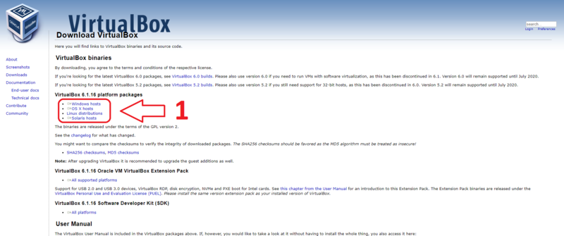

Now, click the downloaded file.

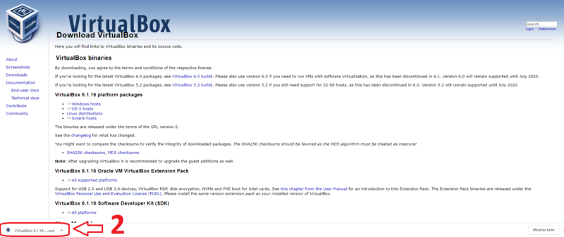

click **“Next”**.

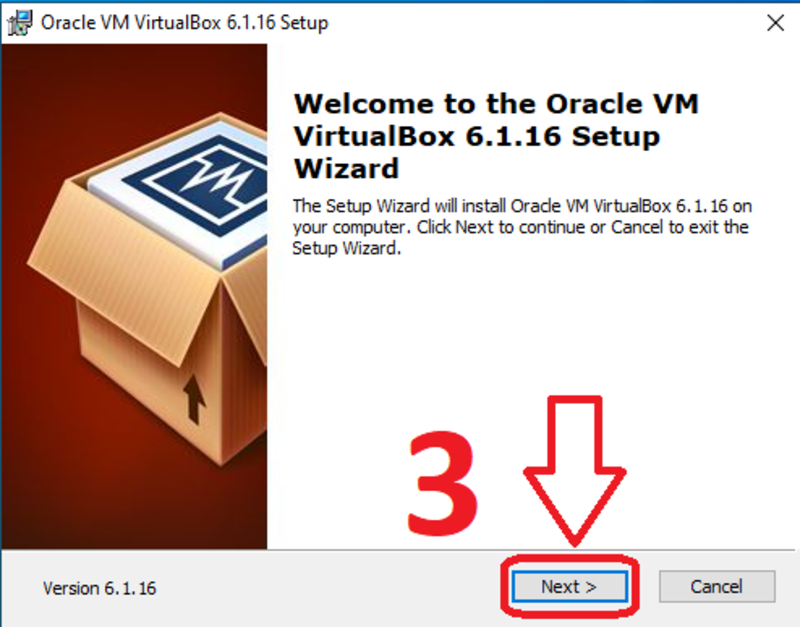

Now, click **“Next”**.

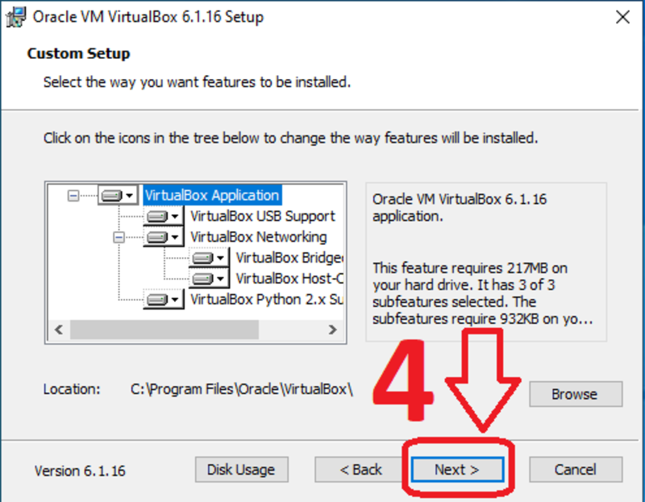

click **“Next"**.

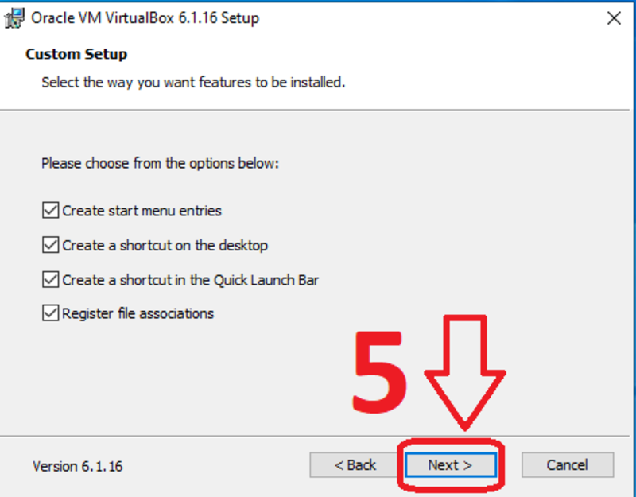

click **“Yes”**.

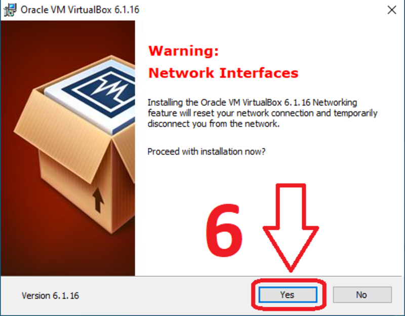

click **“Install”** to put VirtualBox in your operating system.

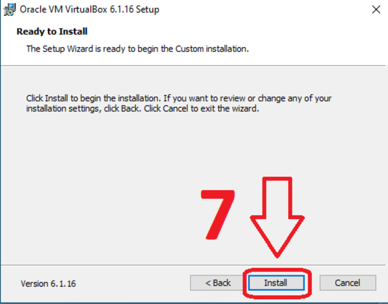

click **“Yes”**.

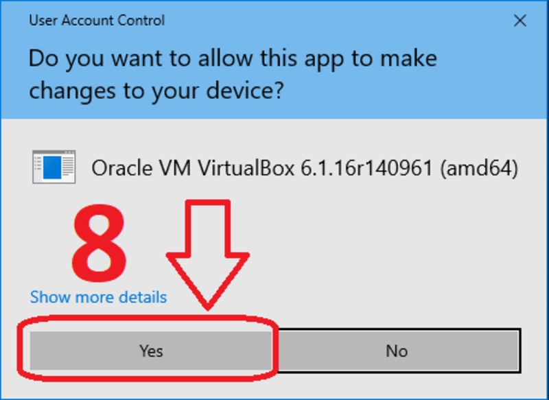

click **“Finish”** to finalize the installation and open VirtualBox.

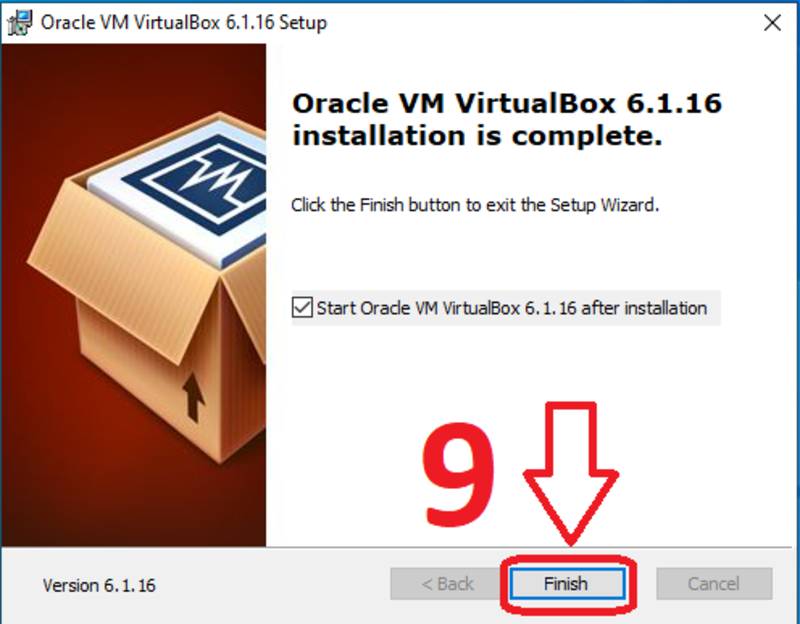

Now we have VirtualBox installed.

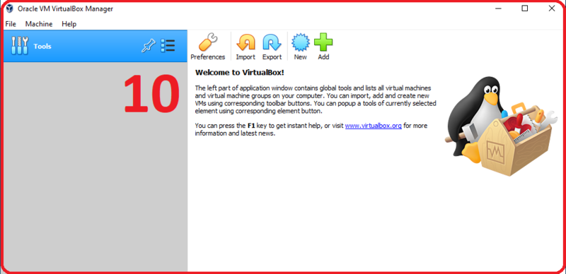

## Create a virtual machine in Windows

Download the Ubuntu ISO image from the [official site](https://ubuntu.com/download/desktop). At the moment of writing this, the latest long-term support version is 24.04.4.

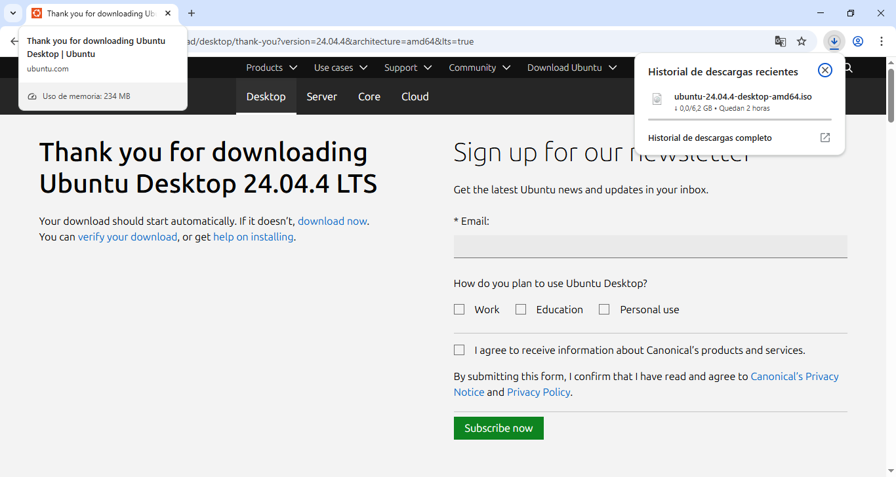

To create a virtual machine, click **“New”**.

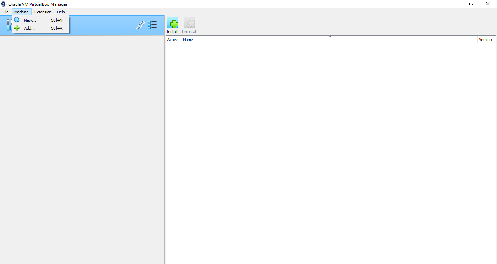

Now, write the name of the virtual machine, upload the ISO file and click **“Next”**.

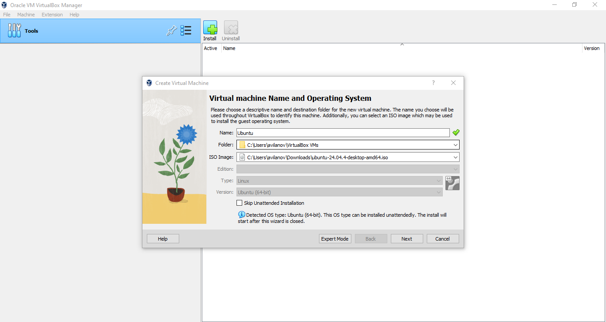

Choose a username and password, check "Guest Additions" and click **“Next”**.

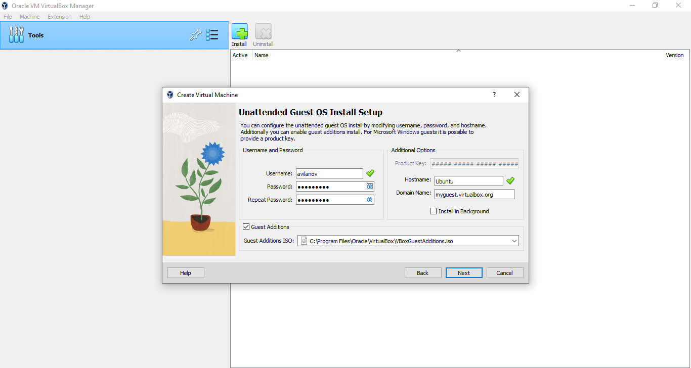

Establish the memory RAM and number of processors of the virtual machine. I recommend put a half of the total memory RAM of the computer if you have only 1 virtual machine. For the number of processors, 2 is recommended. When you finish click **"Next"**.

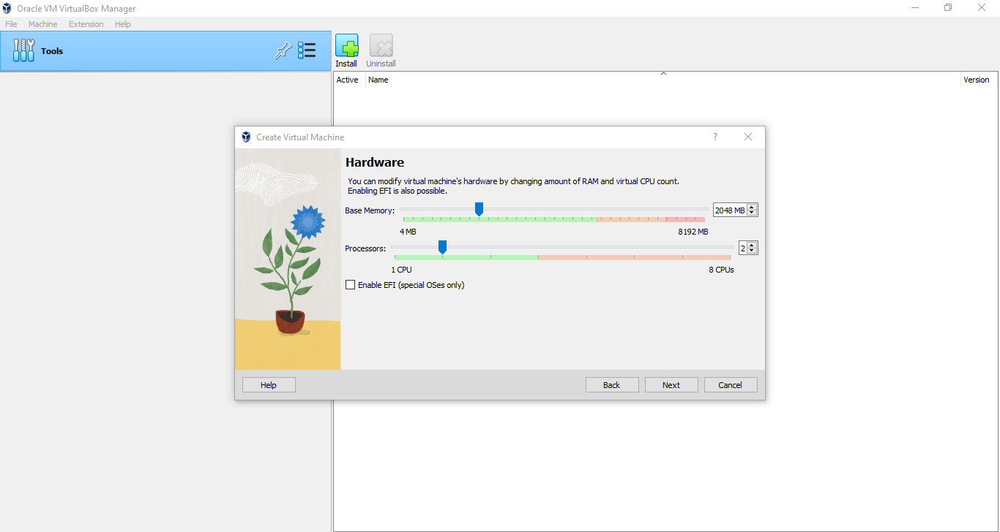

Now, click **“Create a Virtual Hard Disk Now”** to create a disk for the machine and click **"Next"**.

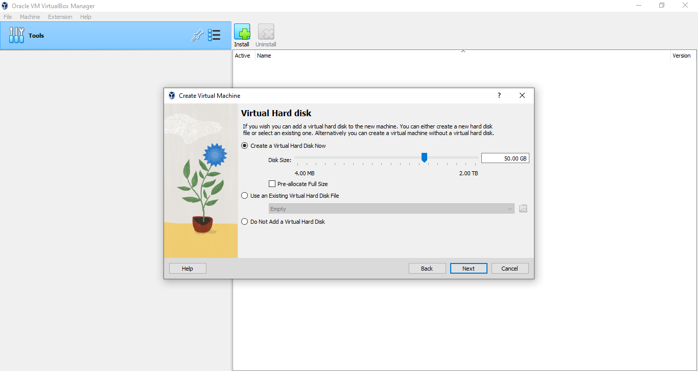

click **“Finish"**.

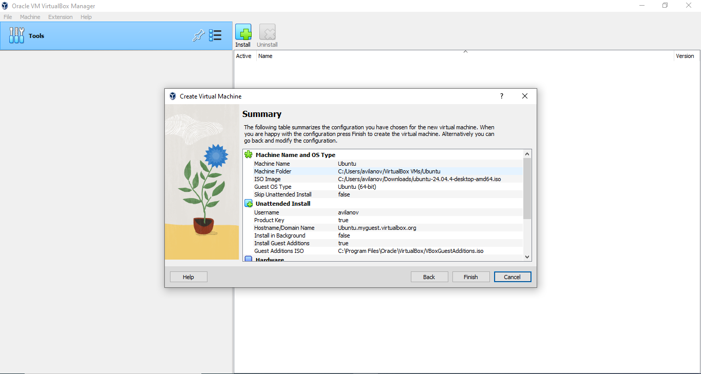

We have the virtual machine created. Before we start it, we should change some settings. To change them, click **“Settings”**.

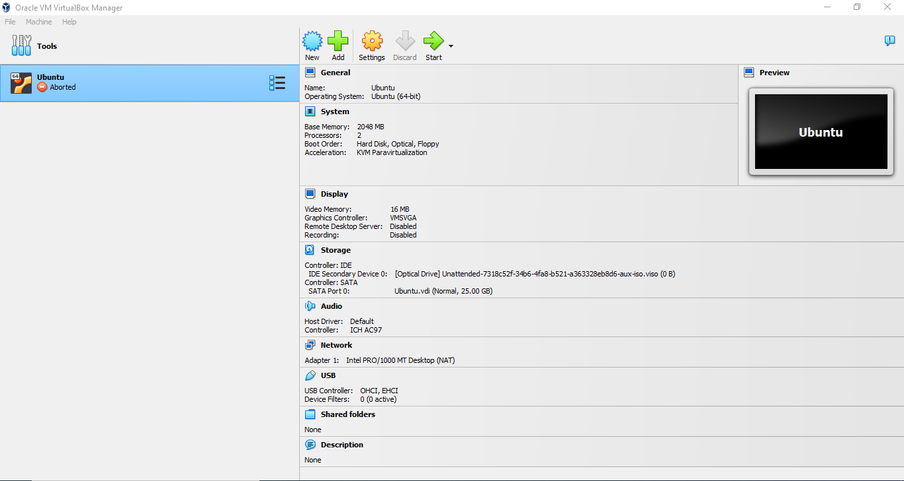

Go to General -> Advanced and set Bidirectional on Shared Clipboard and Drag'n'Drop. 

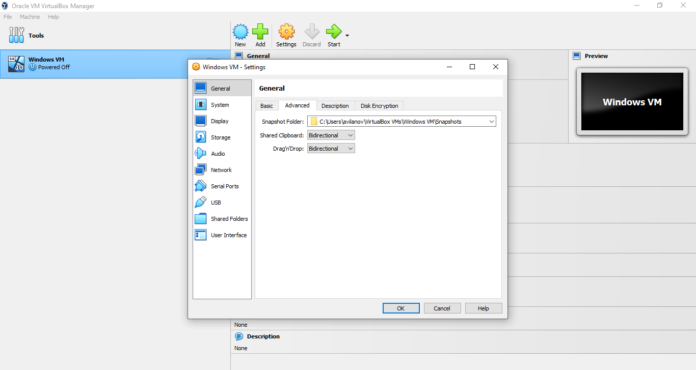

Now we have completely created the virtual machine. To start it click **“Start”** and it will begin powering up. 

If you encounter the error:

```
VM Name: Ubuntu

Not in a hypervisor partition (HVP=0) (VERR_NEM_NOT_AVAILABLE).
VT-x is disabled in the BIOS for all CPU modes (VERR_VMX_MSR_ALL_VMX_DISABLED).

Result Code:
E_FAIL (0X80004005)

Component:
ConsoleWrap

Interface:

IConsole {6ac83d89-6ee7-4e33-8ae6-b257b2e81be8}
```

Please follow the instructions of this video https://www.youtube.com/watch?v=jx-Oej9rSiI to solve the issue, which consist on turning Virtualization Technology on from the Bios settings. Once you are done, try to start the virtual machine again. 

If it asks you if you want to try and install Ubuntu, click Enter and the installation of the OS will start. You might be prompted to answer some more questions related to the installation, just click **Next** in every step and input the username and password you entered before.

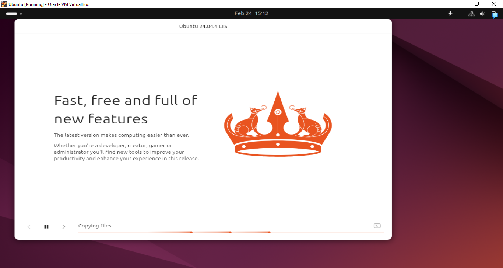

If the Ubuntu installation inside the VM never starts and the screen stays black, remove your machine and recreate the machine following the previous steps.

## Install conda on VM

Once the virtual machine is created, we need to install conda. We recommend Miniconda because it is lightweight. You can download the .sh file **for Linux** onto your VM from [the official website](https://www.anaconda.com/docs/getting-started/miniconda/install#linux-2) after creating an account. If you get an error and your VPN is active, make sure to deactivate it before downloading it.

From the terminal on the VM run:

```bash
cd /home/{user}/Downloads
bash Miniconda3-latest-Linux-x86_64.sh
```

If conda is not detected after the installation finishes, run:

```bash
echo 'export PATH="/home/{user}/miniconda3/bin:$PATH"' >> ~/.bashrc
source ~/.bashrc
conda init
```

Close your terminal and reopen it.

## Install git on VM

Install git using:

```bash
sudo apt install git
```

## Install Providentia on VM

We can now install Providentia:

```bash
cd /home/{user}/Desktop (your preferred location)
git clone https://github.com/BSC-ES/providentia.git
```

## Download data onto your VM

If you want to store the data used by Providentia on your Windows machine, you will need to mount the directories in the VM. If you haven't mounted them, the data will be downloaded to and read from `/home/{user}/data`, a folder inside the VM. 

Remember that you can use the [download mode](Download) of Providentia to get data from Zenodo, ACTRIS and CAMS, and also from the MN5 if you have access to the machine.

If you have access to MN5 and want to download data from there without using a password, you will need to create a public SSH key. In order to do this, run this command from the from WSL:

```bash
ssh-keygen -t ed25519
```

You can click enter to save file to default location and keep the paraphrase empty. Now copy the content within `~/.ssh/id_ed25519.pub` on WSL inside `~/.ssh/autorized_keys` on MN5 (you can connect to it as you would usually do). Once that's done, you can download data easily.