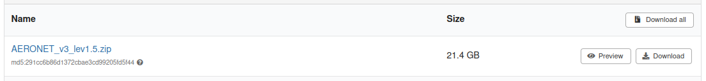
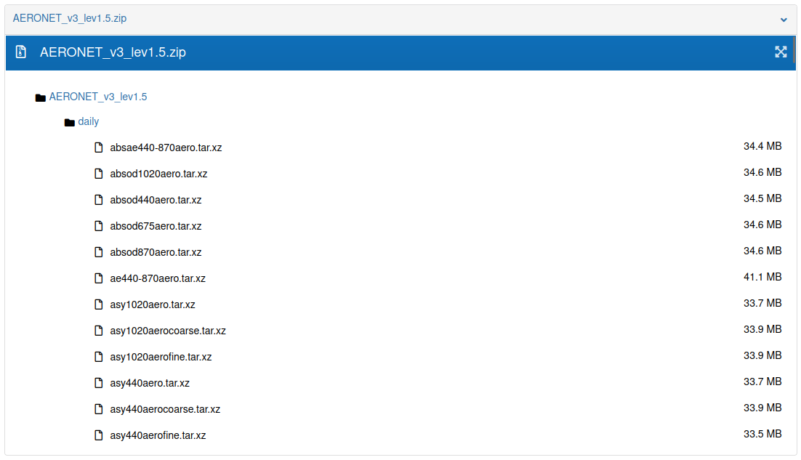

# Zenodo

Providentia's download mode supports downloading **GHOST** observational data from **Zenodo**.

No Zenodo account is required to download the files.

## Available GHOST versions

Currently, two versions of GHOST uploaded on Zenodo are available for download:

- **[1.5](https://zenodo.org/records/10637450)**
- **[1.5.1](https://zenodo.org/records/15075961)**
   
## How to enable Zenodo download

Make sure to set:

```ini
dl_ghost_source = zenodo
```

or

Answer `n` to the prompt: 

_"Do you want to download from the BSC remote machine? (Otherwise, GHOST data will be retrieved from Zenodo)"_

## Available networks

To download a network, choose one of the networks from the options per data version below.

### Version 1.5

These are the available networks for version **1.5**:

* `AERONET_v3_lev1.5`
* `AERONET_v3_lev2.0`
* `CANADA_NAPS`
* `CAPMoN`
* `CHILE_SINCA`
* `EBAS-ACTRIS`
* `EBAS-AMAP`
* `EBAS-CAMP`
* `EBAS-COLOSSAL`
* `EBAS-EMEP`
* `EBAS-EUCAARI`
* `EBAS-EUSAAR`
* `EBAS-HELCOM`
* `EBAS-HTAP`
* `EBAS-IMPACTS`
* `EBAS-Independent`
* `EBAS-NILU`
* `EBAS-NOAA_ESRL`
* `EBAS-NOAA_GGGRN`
* `EBAS-OECD`
* `EBAS-UK_DECC`
* `EBAS-WMO_WDCA`
* `EBAS-WMO_WDCRG`
* `EEA_AIRBASE`
* `EEA_AQ_eReporting`
* `GHOST-PUBLIC`
* `MEXICO_CDMX`
* `MITECO`
* `UK_AIR`
* `US_EPA_AQS`
* `US_EPA_AirNow_DOS`
* `US_EPA_CASTNET`
* `US_NADP_AMNet`
* `US_NADP_AMoN`
* `WMO_WDCGG`

### Version 1.5.1

These are the available networks for version **1.5.1**:

* `AERONET_v3_lev1.5`
* `AERONET_v3_lev2.0`
* `CANADA_NAPS`
* `CAPMoN`
* `EANET`
* `EBAS-ACTRIS`
* `EBAS-AMAP`
* `EBAS-CAMP`
* `EBAS-EMEP`
* `EBAS-EUCAARI`
* `EBAS-EUSAAR`
* `EBAS-GUAN`
* `EBAS-HELCOM`
* `EBAS-IMPACTS`
* `EBAS-IMPROVE`
* `EBAS-Independent`
* `EBAS-NILU`
* `EBAS-NOAA_ESRL`
* `EBAS-OECD`
* `EBAS-RI_URBANS`
* `EBAS-WMO_WDCA`
* `EEA`
* `GHOST`
* `INDAAF`
* `UK_AIR`
* `US_EPA_AQS`
* `US_EPA_CASTNET`
* `US_NADP_AIRMoN`
* `US_NADP_MDN`
* `US_NADP_NTN`
* `WMO_WDCPC`

## Explore network contents

To view the available data for each network, visit the Zenodo page for one of the versions, you can find the links in [this](#available-ghost-versions) section.

When scrolling down, you will find the list of available networks, where the name and the total size for each network are shown.



Larger networks contain more NetCDF files and therefore take longer to download. Some ZIP files may take several hours to complete, depending on their size.

In order to see the ZIP file contents on the network you’re interested in, open the **Files** dropdown and click **Preview**.
  
Once this is done, open the dropdown named after the network. The **first-level directories** correspond to the *resolution*, and the **second-level directories** correspond to the *species*.



## Example configuration file

For the example shown above, the corresponding configuration file is as follows:

```ini
[zenodo-AERONET_v3_lev1.5] 
ghost_version = 1.5
start_date = 20210101 
end_date = 20220101
species = absae440-870aero
network = AERONET_v3_lev1.5
resolution = daily
dl_ghost_source = zenodo
```

Also, another example using a lighter network with faster download times:

```ini
[zenodo-EBAS-NILU] 
ghost_version = 1.5
network = EBAS-NILU
start_date = 202001
end_date = 202101
species = sconcno3, sconco3, sconcna
resolution = daily
dl_ghost_source = zenodo
```